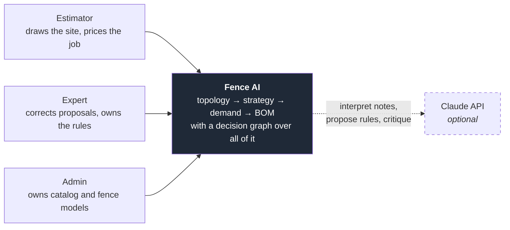
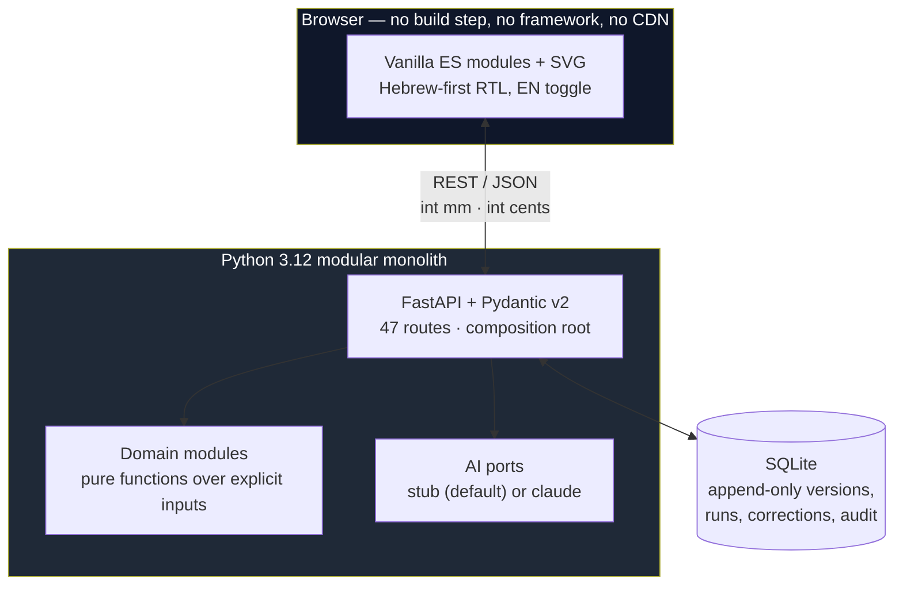
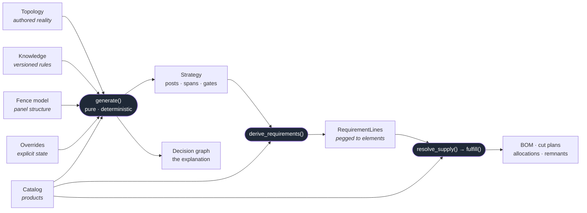
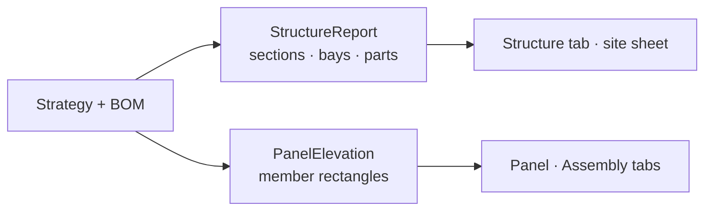

# 00 — Overview

Fence AI turns a **drawing of a site** into a **priced bill of materials**, and can
explain every number in it. Between those two ends sit a construction topology, a
typed knowledge base, a product-structure model, a deterministic generator, and a
persisted decision graph.

The unusual property is not the optimisation. It is that **the whole chain is
reproducible and explainable**: the same inputs always produce the same fence, and
every element, requirement and BOM line can be walked back to the rule and the fact
that caused it.

---

## Who uses it

The Claude link is dashed because it is **optional by construction**. A deterministic
stub implements the same ports and understands the demo vocabulary in English and
Hebrew, so the entire system works offline (ADR-0009).

---

## Containers

Deliberate absences, each with a reason in [`06-choices.md`](06-choices.md): no build
step, no framework, no CDN, no ORM, no message queue, no cache tier.

---

## The spine

Every stage is a **pure function over explicit inputs**. Persistence happens between
stages, never inside them.

A `GenerationRun` records the **identity of the inputs** — topology revision,
knowledge snapshot hash, overrides, policy, fence-model versions, the SKUs the run
named, objective preset — and the run id is a content hash over that identity. A
later read against a moved catalog or an edited drawing **refuses** (409
`catalog_changed` / `topology_changed`) rather than silently recomputing.

Read models hang off the side of the spine and are **derived, never stored**:

`StructureReport`'s governing property is **Σ(parts) ≡ BOM** — it inverts existing
pegs and is forbidden from recomputing a quantity.

---

## A job, end to end

| # | Step | Where it lives |
|---|---|---|
| 1 | Draw the site — runs, corners, ground heights | `topology`, `js/editor.js` |
| 2 | Say what is true of it — heights, gates, bases, free-text notes | `topology` events, `project` annotations |
| 3 | Choose what it is built from — a fence model, per project or per stretch | `fencemodel`, `js/panel.js` |
| 4 | **Generate** — explicitly, never automatically | `strategy/generator.py` |
| 5 | Inspect why — click any element, read its decision trail | `decisions`, `js/inspector.js` |
| 6 | See it — plan, profile, run elevation, panel assembly | `report`, `js/runview.js`, `js/elevation.js` |
| 7 | Price it — BOM, cut plans, stock netting, an immutable quote | `demand`, `fulfillment` |

Steps 5 and 7 feed back: an expert correction becomes a knowledge **candidate**,
inert until reviewed, and the review shows *"this would affect N of your projects"*
before anything is approved.

---

## What the system refuses to do

These are load-bearing and recur in every document here.

* **No AI inside deterministic computation.** AI interprets text, proposes rules and
  critiques results. It never selects a product or places a post.
* **No number invented to fill a gap.** An undeclared post face draws as a flagged
  nominal; an unresolvable cut length is an error, not a plausible integer.
* **No silently ignored field.** A schema field the resolver does not honour is
  refused at load by name, with the reason (`_UNSUPPORTED` in `fencemodel/model.py`).
* **No auto-generation.** Generation stays behind an explicit button.
