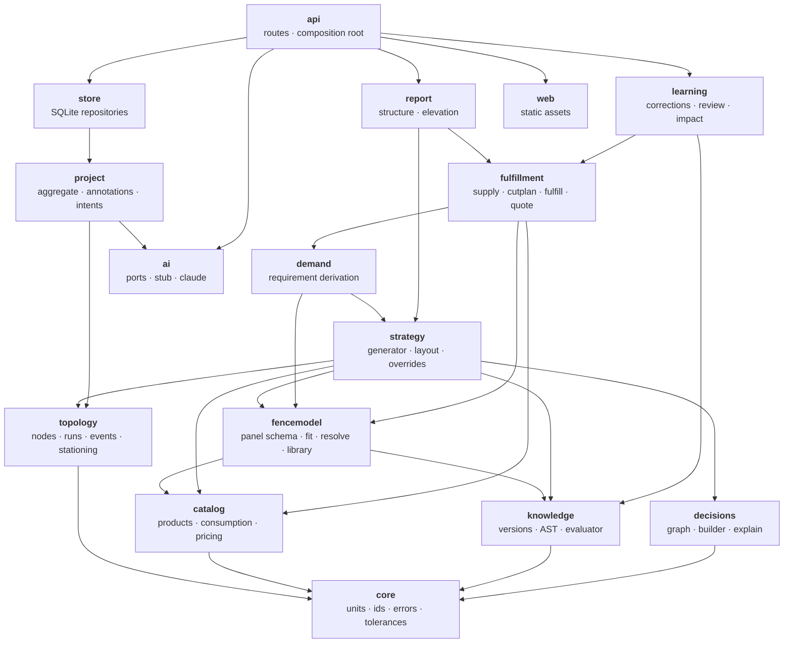
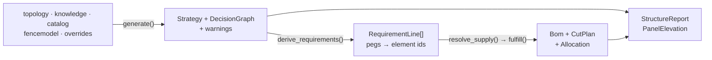

# 01 — Domains

Sixteen modules under `src/fenceai/`, grouped into six bounded contexts plus three
edges. The grouping is conceptual; the **dependency rule is mechanical** and is the
thing to preserve.

---

## The rule

> Arrows point one way only. A module may import what is below it and never what is
> above it.

`topology` never imports `strategy`. `demand` and `fulfillment` read strategy output
and never reach back into generation. `decisions` is a passive data structure that
everyone writes into through `GraphBuilder`. `ai` sits behind ports and is invoked
only by `api`, `learning` and `strategy` — never inside a deterministic calculation.

> **Note.** `system-design.md`'s module map predates `fencemodel` and `report`; both
> are added there alongside this document.

---

## What each domain owns

### Foundation

| Module | Owns | Never |
|---|---|---|
| `core` | Integer millimetres and cents, the **two** named tolerances, id generation, the refusal types (`ReadRefused`, `GenerationFailure`) | Knows nothing about fences |

### Authored reality — what a human said is true

| Module | Owns | Never |
|---|---|---|
| `topology` | Nodes, runs, station events (gates, bases, heights, top lines, tilt, obstacles), proportional re-anchoring | Mutated by generation |
| `project` | The aggregate: topology + annotations + overrides + policy + model choice. Verbatim human text; intent confirmation | Interprets text itself — that is `ai` |

Annotations are **immutable verbatim**; an AI interpretation is a *proposal* until a
human confirms it, at which point it materialises as a first-class event carrying
provenance back to the words.

### Reference data — what the company knows and stocks

| Module | Owns | Never |
|---|---|---|
| `catalog` | Products as **consumption behaviour**, not SKU rows: indivisible, divisible-linear, packaged, coverage-based, assembly kits. Flat and per-metre pricing | Decides what a fence needs |
| `fencemodel` | Panel **structure** — frame slots, infill patterns, fixings, eligibility, option axes, variants, joints. Immutable versions, load-time validation, the 1-D pattern fit | Owns numbers that can conflict (max span, rail count) — those are knowledge |
| `knowledge` | Typed, versioned rules: fact / hard constraint / company rule / preference / heuristic / override / candidate. A closed condition AST and an owned evaluator. Authority → specificity → recency precedence | Exists only in a prompt (ADR-0005) |

The seam between the last two is `LayoutPolicy`: a model states its span
requirements as **knowledge-shaped contributions** scoped `series=<model_id>`, each
at its own authority, so a manufacturer maximum stays a hard constraint while a
nominal width stays a beatable preference. The model gets no private channel into
the generator.

### Generation — the proposal and its explanation

| Module | Owns | Never |
|---|---|---|
| `strategy` | `generate()`: post placement, closed-form span layout, vertical mode, heights, safety checks, warnings. Overrides as first-class patches | Impure or non-deterministic (ADR-0004) |
| `decisions` | The append-only graph, acyclic by ordinal, and per-language explanation templates | Reconstructed after the fact — it is built *during* generation |

An override is anchored to `(run_id, station, kind)` — never to generated element
identity, which does not survive regeneration.

### Materials — from structure to purchase

| Module | Owns | Never |
|---|---|---|
| `demand` | `RequirementLine`s pegged to the strategy elements that caused them | Knows about purchasing, stock or price |
| `fulfillment` | Eligibility → SKU resolution, FFD cut planning with kerf and remnants, package rounding, coverage, kits, inventory netting, immutable quotes | Recomputes structure |
| `report` | `StructureReport` and `PanelElevation` — read models **derived, never stored** | Recomputes a quantity; it inverts pegs |

### Feedback and edges

| Module | Owns |
|---|---|
| `learning` | Corrections → knowledge **candidates** (never auto-active) → review; portfolio impact preview |
| `ai` | Three ports: interpret an annotation, propose knowledge from corrections, critique a result. Stub and Claude adapters |
| `store` | SQLite repositories. Eight tables, documents as JSON, append-only versions. No domain logic |
| `api` | 47 REST routes and the composition root — the only place that wires everything |
| `web` | Static ES modules and SVG. Server JSON in, pixels out |

---

## The contracts that cross boundaries

These are the interfaces worth knowing; everything else is internal.

**`RequirementLine` is the narrowest waist in the system.** Demand emits *what the
fence needs* with no SKU and no unit; `resolve_supply` writes both in one statement
from the product it chose, because the parts ledger balances per `(sku, unit)` and a
guessed unit made the same item read as unassigned **and** from-stock at once.

The four call sites that once copied `derive → resolve → fulfill` are now
`fulfillment/pipeline.py`, which closed a real divergence: `create_quote` loaded the
catalog directly and so was the only endpoint exempt from the staleness check — the
one route freezing an immutable commercial document.

---

## Where a new concept goes

| If it is… | It belongs in… |
|---|---|
| something a human draws or states | `topology` / `project` |
| a fact about a product you buy | `catalog` |
| the structure of a panel | `fencemodel` |
| a number that two rules could disagree about | `knowledge` |
| a consequence of geometry | `strategy` |
| a way of buying or cutting | `fulfillment` |
| a way of presenting what already exists | `report` |

If a concept seems to need two of these, it is usually two concepts. The rail
**count** is knowledge; where the rails **sit** is the model; what a rail **is** is
the catalog.
