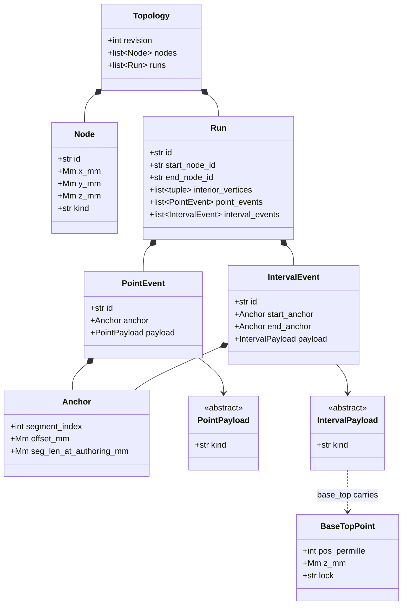
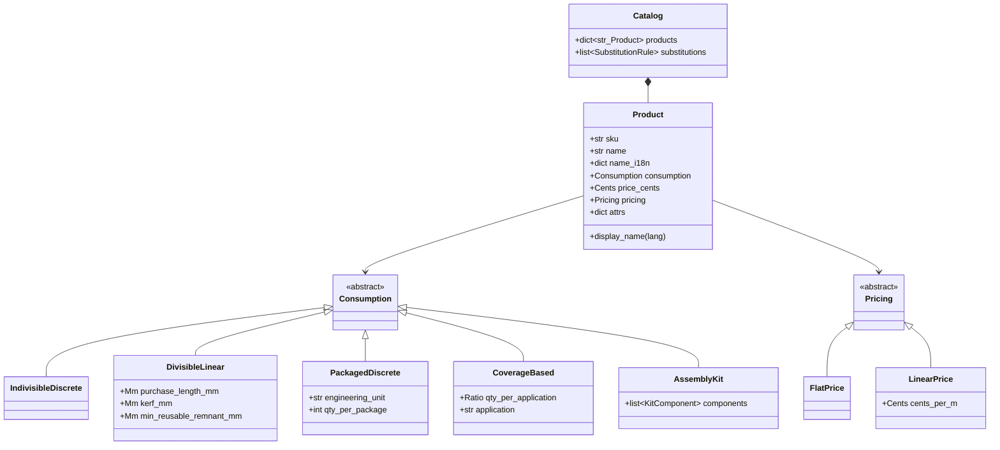
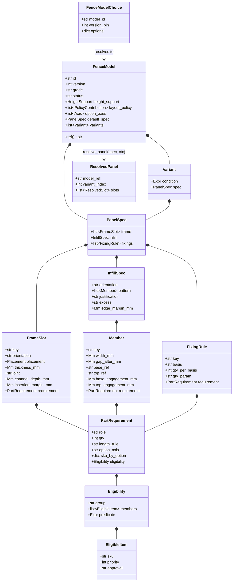
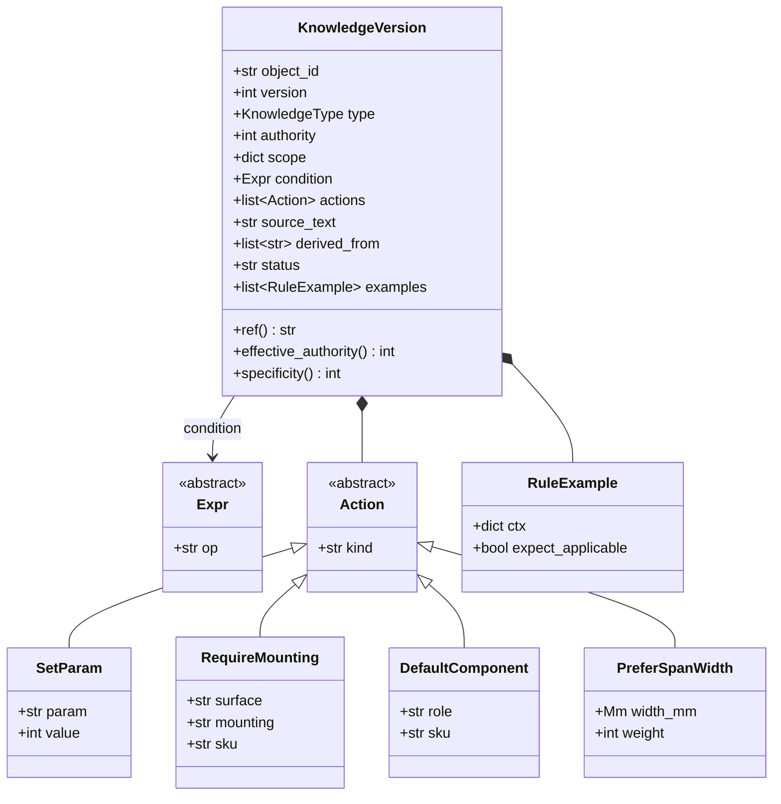
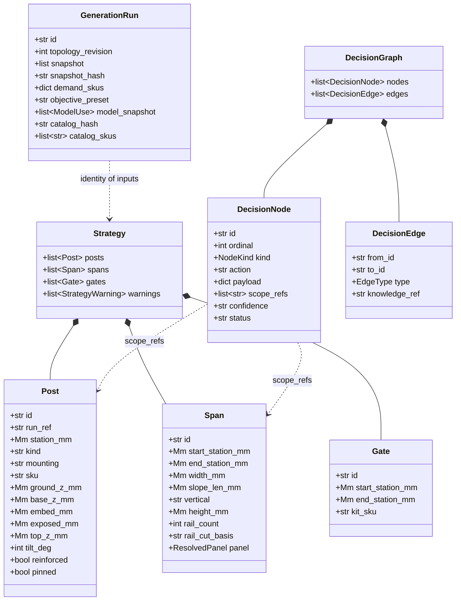
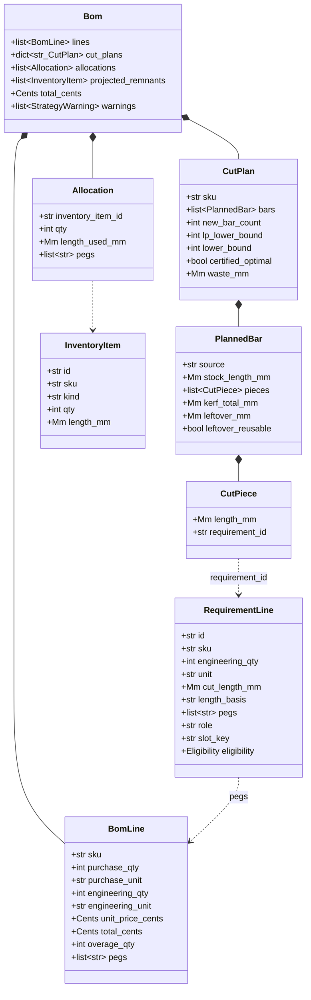
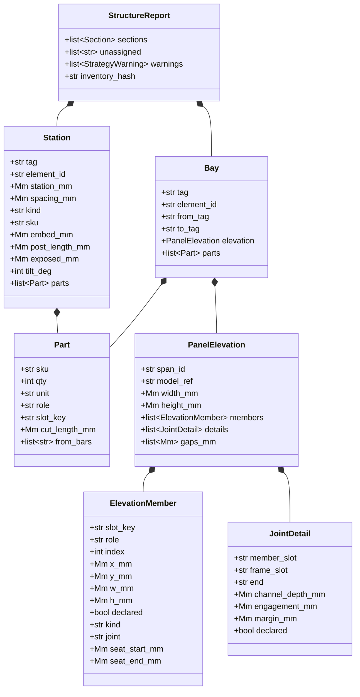
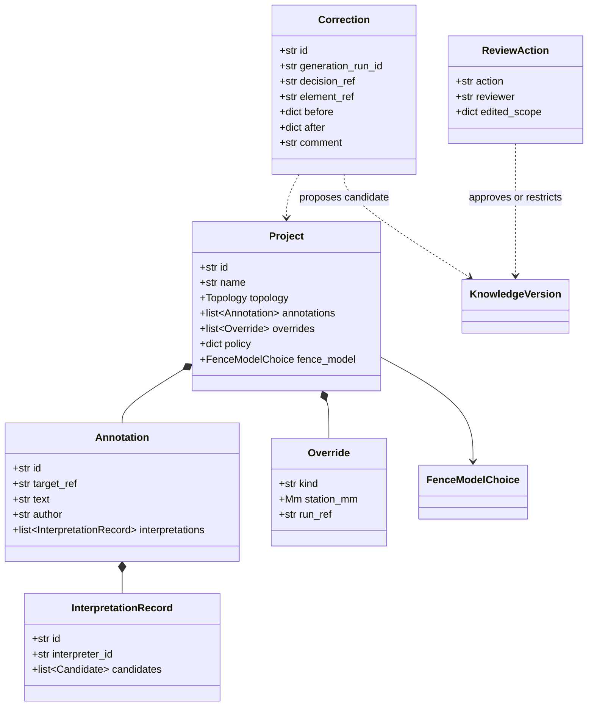

# 02 — Entities

UML class diagrams per domain, drawn from the Pydantic models. Each section names
the file it was drawn from — check it in one command before trusting a diagram.

Conventions: `Mm` is integer millimetres, `Cents` integer cents (ADR-0002). A
discriminated union is drawn as inheritance from an abstract base; the discriminator
is always a `kind` literal.

---

## Topology — authored reality

`src/fenceai/topology/model.py`

**Point payloads:** `gate`, `obstacle`, `existing_foundation`, `elevation_sample`,
`corner_override`. **Interval payloads:** `base`, `height_intent`, `top_line`,
`wall_profile`, `base_top`, `post_tilt`, `fence_model`.

**Why anchors and not stations.** A station is derived. An event stores
`(segment_index, offset_mm, seg_len_at_authoring_mm)` so it **re-anchors
proportionally** within its originating segment when the geometry is edited — drag a
vertex and the gate stays where the user meant it (ADR-0003). Frontend and backend
implement the same two functions: `anchorFor` / `make_anchor` and
`stationOfAnchor` / `anchor_station`. Reading `anchor.offset_mm` as a station is a
bug in both languages.

**Duplicate ids are refused at the model boundary**, so a bad PUT is a 422 rather
than geometry that silently merges two objects downstream.

---

## Catalog — products as consumption behaviour

`src/fenceai/catalog/model.py`

**A product is not a row, it is a behaviour.** The five consumption kinds are what
make the same pipeline buy a post, cut a bar, round up a box of screws, pour a
footing and explode a gate kit. `purchase_price_cents()` is the single read and the
one rounding point; a rate-priced product may not also carry a flat price, because
two fields that can each claim to be the price is a lie waiting to happen.

**`attrs` is an open bag on purpose.** What a product is made of is the catalog's
answer, not the code's — a company that stocks bamboo adds a product and a locale
word, not a release.

---

## Fence model — panel structure

`src/fenceai/fencemodel/model.py`, `selection.py`, `resolve.py`

**A choice is not a model.** `FenceModelChoice` is a reference plus option answers,
and lives in its own import-free module because `topology` and `project` both need to
say *"this stretch is built to that"* without depending on the resolver, the catalog
or the knowledge AST. `version_pin=None` follows the newest active version; an
integer freezes it **even after that version is retired**, because a stored run must
stay reproducible.

**`_UNSUPPORTED` is a first-class mechanism, not a TODO list.** A schema field the
resolver does not honour is refused at load, by name, with the reason. Deleting an
entry is how a wave turns a feature on — and the resolver change and the entry's
removal are the same commit.

---

## Knowledge — rules as data

`src/fenceai/knowledge/model.py`, `ast.py`

**AST ops** (closed set): `field`, `lit`, `cmp`, `and`, `or`, `not`, `in`, `between`,
`fn`. **Actions** (closed set): `set_param`, `require_mounting`,
`require_post_reinforcement`, `prefer_equal_spans`, `prefer_min_span_width`,
`prefer_span_width`, `prefer_vertical`, `default_component`, `add_note`,
`flag_for_review`. A field the context does not supply raises `MissingField`, which
means *not applicable* — never *false*.

**Seven types, four distinct handlings.** `fact`, `hard_constraint`, `company_rule`,
`preference`, `heuristic`, `override`, `candidate`. A hard constraint is not a
preference is not an objective is not an override — they have different types and
different code paths. A hard tie is a **generation failure**, not a coin flip.

**Versions are immutable and runs stamp their snapshot set**, so editing a rule
cannot change what an old run meant. `source_text` holds the human's verbatim words
next to the structured form.

**`specificity()` is `len(scope)`** — precedence is authority → specificity →
recency. Which dimensions are bound during generation is documented in
`knowledge-system.md`; `bind_scope()` derives them generically from generation facts
rather than by hand at each call site.

---

## Strategy and decisions — the proposal and its explanation

`src/fenceai/strategy/model.py`, `decisions/graph.py`

Node kinds: `input_fact`, `rule_firing`, `structural`, `selection`, `vertical`,
`mounting`, `quantity`, `conflict`, `assumption`, `override_applied`, `failure`.
Edge types: `derived_from`, `governed_by`, `defeated`, `input_from`,
`assumption_of`.

**The graph is append-only and acyclic by construction** — an edge may only point at
an earlier ordinal. A `defeated` edge cites the **losing** version, which is what
lets the UI say *"this rule would have applied, and this one beat it."*

**Post fields carry the check that wrote them.** `embed_mm`, `exposed_mm` and
`top_z_mm` are written by `_check_post_lengths` from the same values it measured the
product against, so a run that warns *"this post is 200 mm short"* cannot also be
drawn with a post that looks fine. `None` means "never measured" — a different claim
from `0`.

---

## Demand and fulfillment — from structure to purchase

`src/fenceai/demand/derive.py`, `fulfillment/*.py`

**`RequirementLine` carries two lifecycle states in one type.** `derive_requirements`
emits it with `sku=""` and `unit=""` — deliberately, because only the chosen product
knows the unit and the product is not chosen yet. `resolve_supply` writes both in one
statement. The diagram shows the fields because they exist on the class; it cannot
show that they are meaningless for the first half of the line's life.

That is a genuine modelling weakness, not just a drawing limitation: nothing in the
type system stops an unresolved line reaching `fulfill()`, which is why `fulfill()`
has to *refuse* a blank sku at runtime. Splitting it into `DemandLine` /
`ResolvedSupplyLine` / `UnresolvedSupplyLine` would make the illegal states
unrepresentable. Recorded, not yet done.

**`pegs` is the traceability invariant.** Every BOM line points back to the
requirement lines that caused it, which point back to the strategy elements that
caused them, which point into the decision graph. A BOM item that cannot be traced
to structural demand is a defect, not a rounding.

**The cut plan certifies itself honestly.** `lower_bound = max(lp_lower_bound,
counting_bound)`, and `certified_optimal` is only true when the plan attains it — a
provably optimal plan is not called "heuristic", and no solver vocabulary reaches a
BOM line.

**Units and offcuts never merge.** A remnant allocation takes the **whole** offcut as
a bin, so half of one is never left over; whatever survives comes back as a
*projected remnant*, which is a different item.

---

## Read models — derived, never stored

`src/fenceai/report/structure.py`, `elevation.py`

**Σ(parts) ≡ BOM is the governing property.** Parts are obtained by **inverting**
existing pegs — element → RequirementLine → BomLine — never by recomputing. Demand
not covered by a purchased line is reported as `unassigned`; demand covered by stock
gets its own `from_stock` bucket, because the identity has to hold in both
directions.

**Tags are derived, never stored** (`A`, `P1`, `B1`, `G1`), and are unique per
element — a shared corner post prints one tag, not two.

**`declared: false` is honesty in the schema.** A member whose face height is a
nominal the read model invented draws dashed and says so, rather than claiming a
precision the catalog does not have.

---

## Project, learning, AI

`src/fenceai/project/model.py`, `learning/model.py`, `ai/records.py`

**The verbatim text is immutable and never replaced by its interpretation.** An
interpretation is a *proposal* carrying candidates; confirming one materialises a
first-class event whose `source` is the interpretation record id, so the chain back
to the human's words survives.

**An override is anchored to `(run_id, station, kind)`** — never to a generated
element id, which does not survive regeneration.

**A correction never becomes an active rule.** It proposes a `candidate`, which is
inert until a reviewer approves, edits, restricts its scope, or rejects it.
