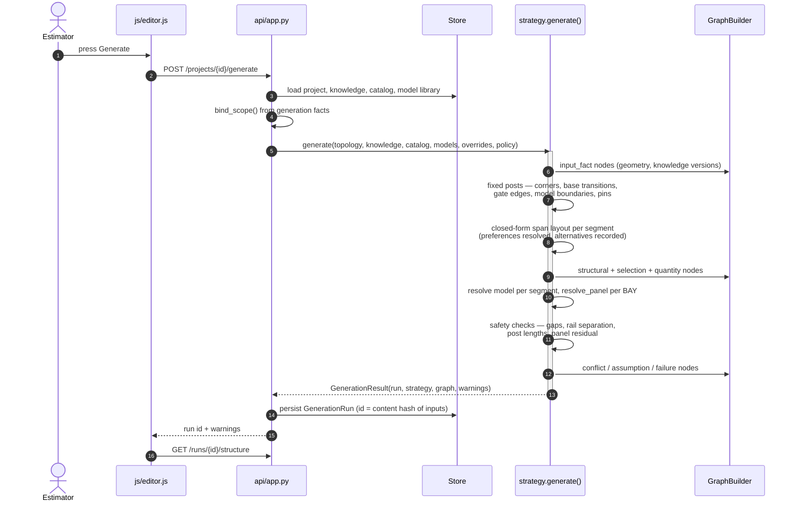
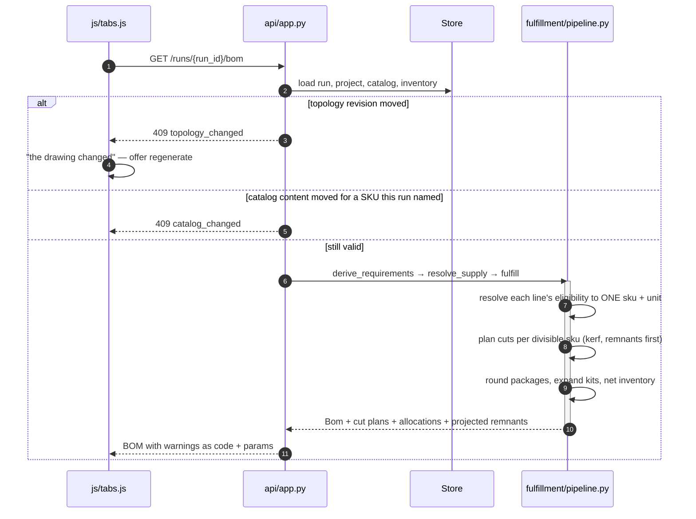
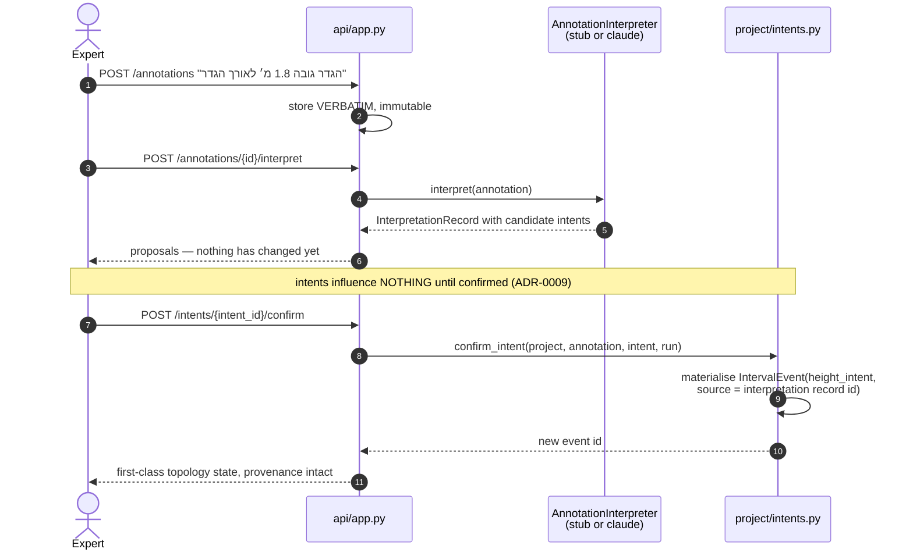
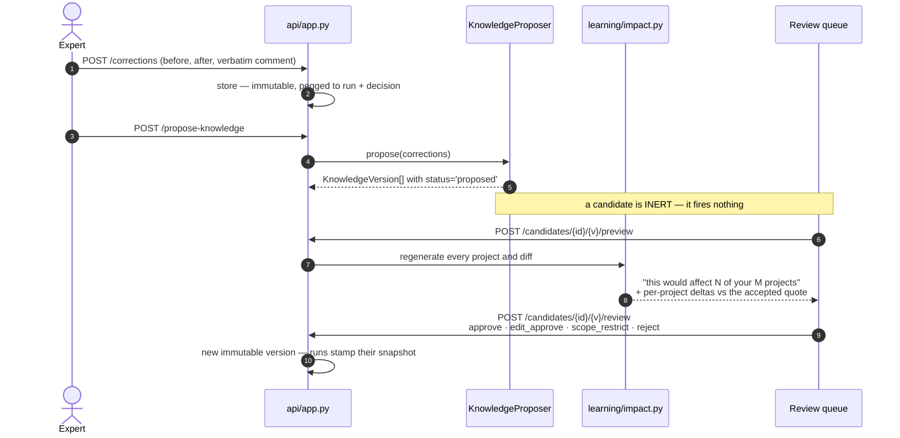
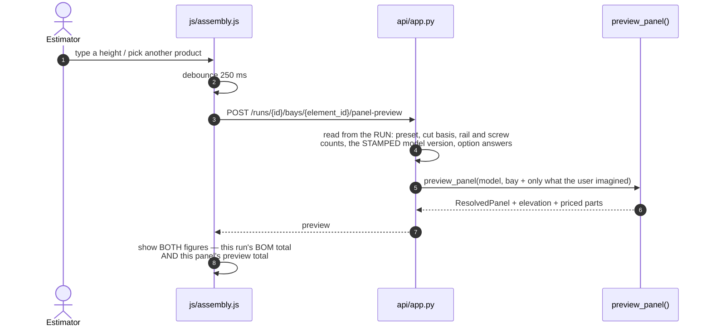

# 03 — Flows

Five sequences worth knowing. Everything else in the API is CRUD.

---

## 1. Generate a strategy

The only place a fence is decided. Explicit, never automatic.

**`generate()` is pure and deterministic** (ADR-0004). Same inputs, same fence,
same run id. That single property is what makes the run-id digest, immutable
quotes, the portfolio impact preview and 155 golden scenarios possible.

**A model boundary is a structural boundary.** A `fence_model` interval event adds
its stations to the fixed set, so no bay ever straddles the place where the fence
visibly changes — spans sample their properties at the mid-point, which would
otherwise hand one model's panel to a bay that is half another's.

**A hard tie fails.** Two hard constraints that cannot both hold raise
`GenerationFailure` with `code + params`, rendered in the reader's language. The
system represents unknowns rather than fabricating certainty.

---

## 2. Read a priced BOM — and refuse a stale one

**One pipeline, four callers.** `/bom`, `/structure`, `/quote` and the impact
preview all run `fulfillment/pipeline.py`. They were four copies once, and the
copies had already diverged: `create_quote` loaded the catalog directly, so the one
endpoint freezing an immutable commercial document was the only one exempt from the
staleness check.

**`catalog_hash` is narrowed to what a run named** — chosen SKUs, every eligibility
rival, kit components transitively. Adding an unrelated product no longer 409s every
prior run; repricing one it bought still does. Safe only because **eligibility is
frozen into the run**.

---

## 3. Free text becomes structure

Foundation §9's central loop, and the one place AI touches authored reality.

The stub understands the demo vocabulary in **English and Hebrew** and is
deliberately capped — it must not become a second rule engine. The Claude adapter is
opt-in and implements the same port.

---

## 4. A correction becomes knowledge

**Impact is shown before the change, not after** (foundation §11). A project that
was *already* failing before the change is reported as `baseline_failed` and is not
counted as affected — the change did not break it.

---

## 5. A what-if that never generates

The Assembly tab prices an imagined panel without touching the stored run.

**The route reads everything the run decided off the run.** An earlier version priced
a stored bay through the model-scoped preview route, which hardcodes `least_cost`,
hardcodes `length_basis="width"` and reads the live catalog — it marked the wrong
product as chosen and priced a bay at 51% of what it cost, under a tag that said *"as
generated"*.

**Two numbers with the same shape and different meanings are named, always.** The
cost strip never silently switches one figure's meaning underneath the reader, and
generation stays behind its own button — the smoke suite counts the project's runs
across a dimension change to prove it.
