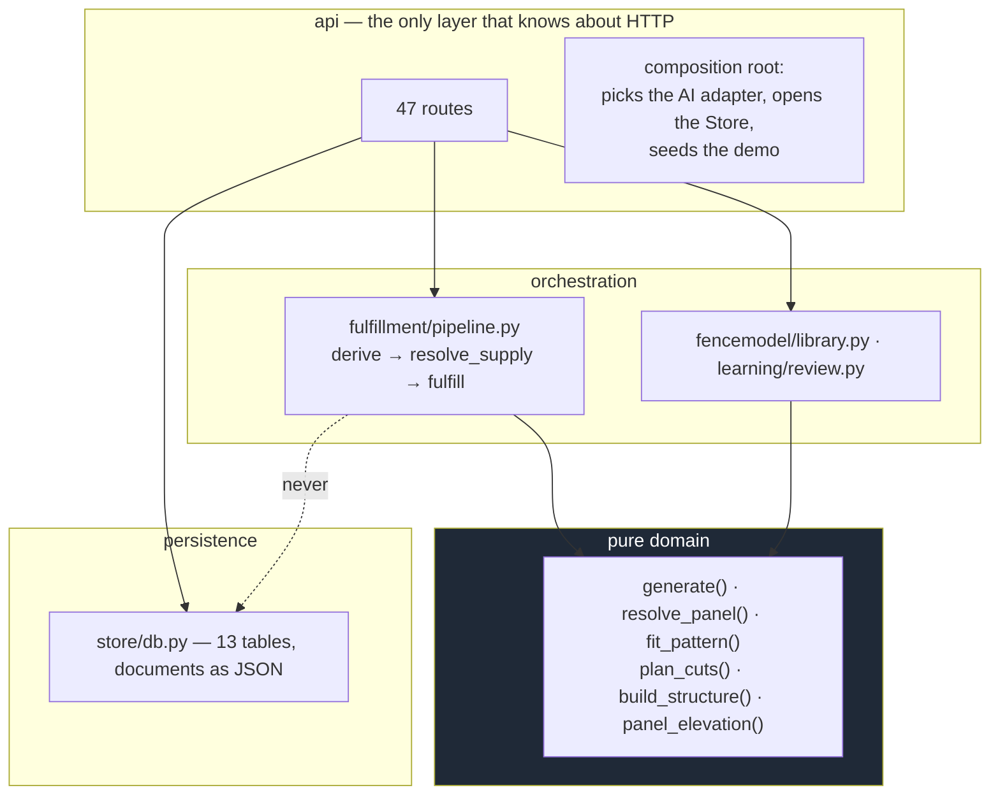

# 04 — Backend

Python 3.12, FastAPI, Pydantic v2, SQLite. One process, no queue, no cache tier, no
ORM. ADR-0001, -0008.

---

## Layers



**The pure layer takes no repository.** Every domain function receives its inputs as
arguments — topology, catalog, knowledge base, inventory — and returns a value.
Persistence happens *between* stages, in the route. That is what makes the whole
domain testable without a database and what keeps `generate()` reproducible.

---

## Two kinds of gate, and the invariant between them

A gate can be authored two ways, and they are different physical claims.

* **In a run** — `GatePayload`, a point event at a station. The fence is
  interrupted: part of that run's layout is consumed by the opening. This is the
  original kind, it is what every stored project and every golden scenario uses,
  and it is unchanged.
* **Beside the runs** — `GateSpan` in `Topology.gates`, joining two nodes and
  lying on no run at all:

  ```
  o------------o  [====gate====]  o------------o
      run rA       the GateSpan       run rB
                   n2          n3
  ```

  *"a run and a gate are different things. the gate is placed next to a run, not
  on it"* — so it combines two runs drawn unconnected and **changes the layout of
  neither**.

Three properties hold this together.

* **A `GateSpan` stores no width.** The opening is the distance between its two
  nodes (`topology.station.gate_opening_mm`), exactly as a run's length is the
  distance between its own. A stored width would disagree with the geometry the
  moment somebody drags a node, and from then on the drawing and the price would
  be about different gates. The four swing facts are validated by the same
  function `GatePayload` uses (`check_swing_coherence`) — one implementation, or
  one of the two ways of drawing a gate quietly starts accepting the nonsense the
  other refuses.
* **One `Gate` element, two origins.** `Gate.run_ref is None` **is** the
  standalone gate: it has no station, its ends are `start_node_id`/`end_node_id`,
  and `width_mm` — populated for both kinds — is the field every consumer reads.
  A reader that subtracted the stations itself would get 0 for every standalone
  gate. In the read models a `None` means *belongs to no section*: `bom_groups`
  leaves it out of the section partition and reports its kit under `unassigned`
  (a group kind of its own is the follow-up and needs a `bom.group_*` locale
  entry in both bundles), `section_decisions` gives it an empty section set, and
  `structure.py` lays it out in `StructureReport.gates` at the top level, between
  the tags of the two posts it hangs from.
* **`_generate_gate_spans` runs after every run is generated, and that placement
  is the design.** Nothing about a run can observe a gate span — every post, bay,
  warning and decision node a run produces is already built and its ordinals are
  already fixed. `tests/strategy/test_gate_span_generation.py` asserts this by
  generating the same topology twice, with and without its gate spans: remove the
  gate's own decision nodes from the first and the two graphs, posts, bays,
  warnings and BOM lines are identical. What the pass *does* add is its own — the
  gate, its kit (through the same `_resolve_gate_kit` / `_check_gate_kit_width`
  path an in-run gate uses) and a post at each of its two nodes, because a gate
  with a post on one side only is unbuildable. A node a run already stands at
  keeps the post the runs decided: the gate-adjacency reinforcement rule in
  `_generate_node_posts` is deliberately **not** extended to a gate span's shared
  nodes, because it would change that post's sku and therefore the BOM of a fence
  the gate was supposed to leave alone.

Both gaps this section used to name are now closed, and both by sharing rather
than by copying.

**`gate_on_slope` reaches a standalone gate.** The limit comes from
`_resolve_gate_max_slope` and the verdict from `_check_gate_slope` — one
resolution and one emission, called by both kinds of gate, so the graph cites the
same winning version and the warning carries the same `code + params` whichever
way the gate was drawn. Only the MEASUREMENT differs, because only the caller
knows where its ground is: an in-run gate reads the run's ground profile at the
opening's two stations, a gate span reads the elevations of its own two nodes.
The span's context is the run path's minus the `run` facts it genuinely has none
of — omitted, so a rule conditioned on one is *not applicable* rather than
false. An unstated elevation is not a slope: `Node.z_mm` defaults to 0 and the
run path reads that same defaulted field through `ground_samples`, so a gate
whose nodes were never given a height warns about nothing, exactly like the run
beside it.

**A force override reaches a gate's own post.** The post `_generate_gate_spans`
emits at a node no run stands at is bought and drawn, and nothing could address
it: the pass never consulted overrides, so a forced sku did nothing and was then
reported back as `orphaned_override`. It now consults `_matched_force_overrides`
— the run path's own matcher — for the posts it CREATES, and records what it
honours in the same `applied` set. No new addressing scheme was needed: such a
post's `run_ref` is `node:<id>` at station 0, which is what the matcher already
compares. The consultation sits after the *"a run already stands here"*
`continue`, so an override cannot become a way around the invariance above —
`tests/strategy/test_gate_span_generation.py` asserts that the same directive
aimed at a shared node leaves that post byte-identical and is reported orphaned.
Suppression stays out: a gate with a post on one side only is unbuildable.

---

## The API surface

63 routes. Grouped by what they are for rather than by path:

| Group | Routes | Notes |
|---|---|---|
| Projects & topology | `GET/POST /projects`, `GET /projects/{id}`, `PUT /projects/{id}/topology`, `PUT /projects/{id}/site`, `PUT /projects/{id}/job`, `PUT /projects/{id}/context`, `PUT /projects/{id}/stated` | The two revisioned PUTs bump their own `revision` server-side — a client that forgot to would make a stale document look current. `/job` is deliberately NOT revisioned: who bought the fence, where, who sold it and when changes no quantity and invalidates no derived view. It is a separate route from creation because a salesperson enters this after the visit from paper — they start with a customer name, draw for twenty minutes, and only then find the address on the sketch, which must not cost them the drawing. `GET /projects` carries `label` beside `name` for the same person: the picker said *"project 7"*. `/context` carries the house, the street and the boundary — everything on the property that is NOT the fence. It is on the PROJECT and never in `Topology`, because a landmark changes no quantity: in the topology it would bump the revision and 409 the structure sheet because somebody nudged a driveway. `/stated` is unrevisioned for `/job`'s reason and carries what the salesperson says this job does NOT have — `no_gates`, `no_promises`. Named facts rather than step keys, so a screen's structure stays out of the project record and `handover_gaps` can contradict a claim the drawing disagrees with without knowing that a road or a step exists. The claim is stored as GIVEN and never validated here: refusing it would mean a salesperson could not record what they believe, which is the one thing the field exists to capture |
| Generation | `POST /projects/{id}/generate`, `GET /projects/{id}/runs`, `GET /runs/{id}` | The only write that decides a fence |
| Explanation | `GET /runs/{id}/explain/{element_id}`, `GET /runs/{id}/sections/{section_id}/decisions`, `GET /runs/{id}/impact/{object_id}` | Takes `lang` **and** `units`. The section view 409s on a moved topology and the element view does not — see below |
| Read models | `GET /runs/{id}/structure`, `GET /runs/{id}/bom`, `GET /projects/{id}/handover` | 409 on stale topology or catalog. `/bom` also carries `grouped` — the same demand by section, panel and decision, and it does NOT 409 on topology. Both are read models that WRITE: `/bom` returns the `supply` run it stored and `/structure` stamps its `supply_id`, through one construction so the sheet and the BOM can never name different yards. Idempotent by digest (ADR-0011). `/handover` is the salesperson MVP's read model and the odd one out: it is derived from the PROJECT rather than from a run, deliberately, because by the time a `Strategy` exists the silent defaults (1800 mm height, `soil` base) have been applied and look decided — catching them before that is its whole point. Both run-scoped ones also carry `quoted_warnings` — every warning the fence models QUOTE from their documents, each placed where §3.3.5 says it renders (`report/annexe.py`): the setting-out sheet draws the annexe, `/bom` draws the product notices on the line group, and each carries the buckets it does not draw so nothing is lost at the edge of a surface |
| Money | `POST /runs/{id}/quote`, `GET/POST /quotes/{id}[/accept]`, `GET /projects/{id}/quotes` | Immutable snapshots with a lifecycle |
| Knowledge | `GET/POST /knowledge`, `POST /knowledge/{id}/{v}/retire`, `POST /knowledge/preview-impact` | Versioned; never edited in place |
| Published knowledge | `GET/POST /knowledge/snapshot`, `GET /knowledge/parts` | The boundary door (contract §1.2). Loading is explicit and never automatic — a knowledge base that swapped itself under a project would change numbers with no action anyone took. The POST's interesting path is the REFUSAL: an unknown contract major, a payload predating §1.1's typed `Date`, or a document whose members do not hash to the id it declares, each a typed 400 with one sentence. `/knowledge/parts` is item 7's surface: every published `SpecField` value with its §1.4 verdict and the `SourceDoc`s its citations resolve to — per value, not per part, because admissibility is decided per value |
| Learning | `GET/POST /projects/{id}/corrections`, `POST /projects/{id}/propose-knowledge`, `GET /candidates`, `POST /candidates/{id}/{v}/review` | Candidates are inert. The GET is filterable by `decision_ref`/`element_ref`/`generation_run_id` |
| Parts | `GET /parts`, `GET /part-types` | The shared library a model's slot names; read-only, versioned like knowledge |
| Vocabularies | `GET /vocabularies` | The length rules, fixing bases and objective presets the schema accepts, so the editor offers exactly them rather than keeping a copy. Names only — the words live in the locale bundles the browser already loads. The seam for the handler registries of `specs/2026-08-25-engine-architecture.md` §4: when a fixing basis becomes a registration rather than a `Literal` arm, only `fencemodel/vocabulary.py` changes |
| Fence models | `GET/POST /fence-models`, `PUT /fence-models/{id}/draft`, `POST .../publish`, `POST .../status`, `DELETE .../{v}`, `POST /fence-models/preview`, `POST /fence-models/{id}/preview-impact` | Publish is the gate |
| Panel preview | `POST /runs/{id}/bays/{element_id}/panel-preview` | Reads the run, not the live catalog |
| Annotations | `POST /projects/{id}/annotations[/{id}/interpret]`, `POST /projects/{id}/intents/{id}/confirm` | Verbatim in, proposals out |
| Overrides | `POST /projects/{id}/overrides`, `DELETE .../{override_id}` | Anchored to `(run, station, kind)` |
| Choices | `PUT /projects/{id}/choices`, `DELETE .../choices/{choice_set}?scope=...` | A row of its own, not part of Overrides, because a choice is **not** an override: nothing was wrong, the data simply left two admissible answers (specs/2026-09-03-design-choices-and-placement-design.md §3). So a selection anchors to a **scope** — `gap:run1:0`, `model:M-VINYL` — instead of a station, and survives a redraw that would kill an override; and it is an *input* to `generate()`, not a patch on its output. PUT upserts on `(choice_set, scope)`: choosing again replaces, or a project would hold two current answers to one question. `asked: false` on the same route is a **pin** (*"we always dig 610, stop asking"*) — the same record with one flag, because pinning and choosing differ in what happens next, not in what was decided. The DELETE takes the scope as a **query** parameter because a real scope is `model:mfr/certainteed/rail` and a path segment cannot carry the slashes |
| Catalog & inventory | `GET /catalog`, `PUT /catalog/products`, `GET/PUT /projects/{id}/inventory` | |
| Evidence | `POST /source-refs:batch` | Fixture-backed (`knowledge/discovery_stub.py`): resolves a `SourceRef.id` (core/gaps.py) against a vendored copy of fence-rag's design fixture, not a live Discovery API — see specs/2026-08-23-frontend-design.md §3. Batched from the first commit so a queue resolving many citations issues one call, not N |
| Ops | `GET /api/health`, `GET /api/audit` | |

Two routes exist that look redundant and are not: `POST /fence-models/preview` takes
an **unsaved** document in its body, while `POST /fence-models/{id}/{v}/preview`
prices a stored one. The first exists because an editor that must save to preview
leaves half-typed model ids in the library forever.

**One asymmetry that is deliberate.** `GET /runs/{id}/sections/{section_id}/decisions`
refuses a topology the run was not generated from (409 `topology_changed`), and
`GET /runs/{id}/explain/{element_id}` does not. A SECTION is a topology object,
so "the decisions for section A" stops being a true sentence once A may no longer
be the stretch the reader is looking at — the same refusal `/structure` makes. An
element id is self-identifying (`post@run1:1500`), so the element view answers
whatever the drawing has since become. The difference is between the two
questions, not between two standards.

**And one anchoring rule a caller must not read past.** A `Correction` may carry a
`decision_ref` (a decision-graph node id) or an `element_ref`, and both are
GENERATED ids — `core/ids.py` states that nothing may reference them across runs.
That is why every correction also carries `generation_run_id`, and why the list
route lets you filter by it: a ref means what it means only inside its own run.

---

## Refusals are typed, localized data

Two exception types carry `code + params`; the English `message` is a fallback only.

```python
ReadRefused(code="topology_changed", message="...", **params)   # → 409
GenerationFailure(code="fence_model_unknown_sku", ...)          # → 422
```

A new code needs `warning.<code>` / `critique.<code>` / `error.<code>` entries in
**both** locale bundles, and `tests/web/test_locale_bundles.py` enforces it — it
scans `api/app.py` and both `code="..."` spellings, which immediately caught four
codes shipping untranslated, including two 409s a user meets whenever they edit a
catalog or a drawing.

**Warnings carry structure, not sentences.** `js/warnings.js` owns the single
`code + params` → sentence path, so a bay is named by its structure-report tag rather
than by an id the server happened to interpolate.

| Situation | Shape |
|---|---|
| The drawing moved under a stored run | 409 `topology_changed` |
| The SITE moved under a stored run | 409 `site_conditions_changed` |
| A product this run bought was repriced | 409 `catalog_changed` |
| Nothing in the catalog can supply a slot | warning `no_eligible_item` + `unresolved` line |
| Candidates were tried and none fits | warning `no_feasible_item` |
| A part could not be measured at all | **error** `panel_length_unresolved` |
| Two **authored** hard constraints conflict | `GenerationFailure` |
| A tie touching a **published** row, inside the hard band | **error** `knowledge_conflict` + `Gap(disputed)`, resolved to the most restrictive contender |
| No rule covers a parameter | warning + `Gap`, laid out to a named basis |
| Knowledge names no default product | **error** + `Gap` + `unresolved` line |

The distinction between a warning and an error is deliberate: a warning describes a
fence built badly, an error describes a part not bought at all. That is also why the
last row is an error rather than a note — every post in the job is unbought, and
supply already says so once per post.

A published tie is the one row where never-blocking is not the whole answer. The
tie-break that picks a winner ends on `object_id`, so letting it decide a safety
limit means the alphabet decides it: two published maxima of 1200 and 2400 built
2400 mm bays or 1200 mm bays depending on what the rows were NAMED. The run still
does not fail — §3.2.4 — but it resolves to the tightest figure every contender
could live with, at the site that knows which direction is safe for its own
parameter. The evaluator cannot know: lower is safer for `max_span_mm` and higher
is safer for `min_rail_separation_mm`.

---

## Persistence

Thirteen tables — twelve document stores plus the append-only `audit_log`. Documents are
stored as JSON `doc` columns; the schema holds only what is queried or ordered by.

```sql
projects(id, doc)
knowledge_versions(object_id, version, status, doc)   -- PK (object_id, version)
fence_models(model_id, version, status, doc)          -- PK (model_id, version)
parts(part_id, version, status, doc)                  -- PK (part_id, version)
generation_runs(id, project_id, created_at, doc)
supply_runs(id, design_id, created_at, doc)
corrections(id, project_id, doc)
inventories(project_id, doc)
catalogs(id, doc)
quotes(id, project_id, status, created_at, doc)
knowledge_snapshots(snapshot_id, loaded_at, doc)      -- the published document
active_snapshot(only_row, snapshot_id)                -- CHECK (only_row = 1)
audit_log(seq, at, actor, action, ref)
```

**The published snapshot is stored as the DOCUMENT, and what we make of it is not.**
`knowledge_snapshots` keeps the bytes the Knowledge Platform sent, keyed by its own
`snapshot_id` — the contract promises a hash resolves to the same bytes until
`retain_until`, which is exactly what makes a document worth persisting. The
versions, the source verdicts (§1.4 `admitted_by`) and the declined bounds are
**re-derived by `knowledge_base()` on every read**, because a verdict is a function
of `(snapshot, policy, task)` and the policy is an operator's editable table:
freezing it would record an answer the next policy edit makes false. Read models are
derived, never stored, and a verdict is a read model. It also leaves one code path
for a fresh load and a reload, so a stored run cannot render different provenance
from a fresh one.

`active_snapshot` is a one-row table because "which snapshot runs resolve against"
is a fact about the installation rather than about any project. The `CHECK` is what
keeps it one row instead of a convention somebody has to remember.

**A run id answers one question; a supply run answers the other.** `generation_runs`
holds the DESIGN — what fence this is, pure and deterministic and reproducible for
ever. `supply_runs` holds what it costs to build from a particular yard, at
particular prices, under a particular objective; that is a statement about a moment
and is legitimately different tomorrow. One design has many supply runs, and a
`Quote` is a supply run somebody decided to stand behind. Both tables are append-only
and idempotent by digest — the id IS the content, so `INSERT OR IGNORE` means a
repeated read of an unchanged yard writes nothing.

**Versioned rows are append-only.** A knowledge version and a published fence-model
version are never updated in place; `DELETE` on a fence model is refused **in the
store** for a published version, because an immutable document any route could delete
is not immutable.

**The store is serialized** (ADR-0008). `Store` holds one `sqlite3.Connection` opened
`check_same_thread=False`, and FastAPI serves sync endpoints from a threadpool — so
overlapping requests interleaved statements on one connection. The visible half was a
500 from `GET /inventory` while a draft was saving, reproduced at **48 failures in
~540 overlapping requests**. The silent half is worse: half of `Store`'s methods are
read-then-write sequences, and another thread's `commit()` landing inside one commits
a transaction nobody finished.

Every public method now takes a re-entrant lock, held for the **whole call**. A
per-thread connection was rejected because it would give every `Store(":memory:")`
test its own empty database. What this does **not** cover is recorded in the ADR:
route-level read-then-write is still a TOCTOU window.

**`TestClient` serialises requests**, so no pytest test can see this class of bug.
The browser smoke suite was the only detector — red there, green on main. That is why
the smoke suite is a release gate and not a nicety.

---

## Testing tiers

| Tier | Command | What it is for |
|---|---|---|
| Unit + integration | `uv run pytest -q` | ~1045 tests over pure functions and routes |
| Golden scenarios | `uv run pytest tests/scenarios -q` | 155 scenarios — the behavioural contract, ⇄ `docs/scenarios/golden-scenarios.md` |
| Compatibility gate | committed per-fixture requirement lines + BOM as JSON | Proves a refactor changed no number |
| Browser smoke | `uv run --with websocket-client python tools/ui_smoke.py` | 159 CDP-driven checks; the only tier that sees concurrency and rendering |

**Mutation is the standard, not coverage.** The recurring failure mode in this
codebase is a green suite over a broken feature — a vacuous assertion
(`buttons == len(options) - 1` evaluating `0 == 0`), a test named for a property it
never asserted, five `runview.js` mutants surviving at once. New tests are expected
to be shown failing against the pre-fix code.
