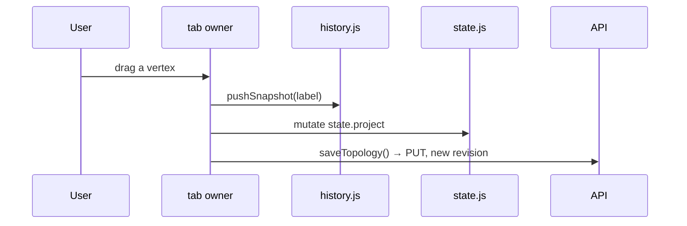

# 05 — Frontend

53 ES modules under `src/fenceai/web/static/js/`, plus SVG and CSS. **No framework,
no build step, no CDN** — fonts are bundled, modules are loaded natively by the
browser (ADR-0010). Hebrew-first RTL with an English toggle.

---

## The rule

> Modules communicate **only** through `state.js` (events and exports). No module
> touches another module's DOM subtree.

`state.js` is the hub: it holds the current project, run, selection and preferences,
and emits events others subscribe to. A tab owner owns exactly one `#tab-*` subtree.

```mermaid
flowchart TD
    subgraph LEAF["pure — no imports, node-testable"]
        BT["base-top.js<br/>base geometry transforms"]
        RV["runview.js<br/>macro elevation placement"]
        JT["joint.js<br/>joint section drawing"]
        LS["landmark-shape.js<br/>property-object geometry"]
        GG["gate-geom.js<br/>opening, swing arc, slide"]
        RM["run-metrics.js<br/>a stretch's length and bearing"]
        AP["api.js<br/>fetch + error rendering"]
    end

    subgraph CORE["core"]
        SS["state.js"]
        GE["geom.js"]
        UN["units.js"]
        I18["i18n.js"]
        HI["history.js"]
    end

    subgraph SHARED["shared"]
        BU["builder-ui.js<br/>one catalog cache"]
        WA["warnings.js<br/>code+params → sentence"]
        SD["structure-data.js<br/>tags + in-flight guard"]
        EL["elevation.js"]
        IN["inspector.js"]
        IM["impact.js"]
        FM["fence-models.js"]
        PD["part-drawer.js"]
        CH["checklist.js"]
    end

    subgraph TABS["tab owners"]
        ED["editor.js — plan canvas"]
        PR["profile.js — side view"]
        ST["structure.js"]
        AS["assembly.js"]
        PA["panel.js"]
        ME["model-editor.js"]
        TB["tabs.js"]
        SI["site.js — site conditions"]
        CX["context.js — the property"]
        GA["gates.js — which gate"]
        NO["notes.js — notes on the drawing"]
    end

    SS --> AP
    SS --> GE
    GE --> SS
    UN --> SS
    I18 --> SS
    HI --> SS

    EL --> GE
    EL --> UN
    SD --> SS
    WA --> SD
    IN --> GE
    IN --> HI

    ED --> GE
    ED --> HI
    ED --> IN
    ED --> SD
    ED --> BU
    ED --> FM
    ED --> WA
    PR --> BT
    PR --> IN
    PR --> SD
    ST --> EL
    ST --> IN
    ST --> SD
    AS --> RV
    AS --> EL
    AS --> JT
    AS --> PD
    AS --> SD
    AS --> BU
    PA --> EL
    PA --> FM
    ME --> BU
    ME --> FM
    ME --> IM
    TB --> BU
    TB --> IM
    TB --> WA
    TB --> NO
    CX --> LS
    CX --> HI
    ED --> LS
    ED --> CX
    ED --> GA
    ED --> NO
    GA --> BU
    GA --> GE
    GA --> GG
    GA --> CX
    ST --> GA
    IN --> RM
    NO --> GE
    NO --> CX

    style LEAF fill:#0f172a,color:#fff
```



*(Edges to `state.js` / `units.js` from every tab owner are omitted — they are
universal.)*

**One observation worth knowing:** `state.js` and `geom.js` import each other. ES
modules tolerate it because neither uses the other at module-evaluation time, but it
is the one place in the graph where the layering is not strict.

---

## The property, and the promises about it

Two surfaces the salesperson's road leans on, and both are deliberately *outside*
`Topology`. A landmark and a note change no quantity, so neither may bump the
topology revision — a nudged driveway must not 409 the structure sheet.

**`landmark-shape.js` is the property registry's frontend half**, pure and
node-tested beside `base-top.js`. `project/model.py: LANDMARK_KINDS` says what is
*recordable*; this module says how each kind is *drawn*:

| gesture | kinds | what it makes |
|---|---|---|
| `polygon` | house | a closed shape built click by click — a building is not a box |
| `band` | street, sidewalk | a rectangle around the dragged centreline, so it has a **width** |
| `rect` | pool, boundary, other | the bbox of the drag |
| `circle` | tree | a 16-gon; there is one shape in the storage model, so a tree is a polygon that reads as a circle |

Only the house and the street are toolbar buttons. Everything else lives behind
one `#tool-other` picker: seven equal buttons on the rail is the opposite of the
screen a non-technical salesperson should open.

Because a band is a rectangle, it is **editable**: `rectMetrics` reads
`{centre, angle_deg, length_mm, width_mm}` off four corners and `rectFromMetrics`
writes them back, which is what the property panel's angle/length/width fields
are. A click-built house has no such reading and is offered none — inventing an
angle for a free polygon would silently square off a shape somebody traced.

**Notes are attached by clicking the thing they are about.** `editor.js`
resolves what is under the pointer in a fixed order — point event, corner node,
run, landmark, else the job itself — and hands `notes.js` a
`{ref, label}`. Interval events (`base`, `height`, `model`) are deliberately not
matched: `base` spans a whole run, so matching it would mean no click on a fence
could ever be about the fence. `target_ref` gained `landmark:<id>` for this; the
field is a free string on purpose, and a note **outlives its referent** — the
drawing is mutable and verbatim human text is not, so every ref is resolved
defensively and an unresolvable one reads as "something no longer on the
drawing".

---

## The front door, and what the header no longer carries

**Signed out, the page is the login screen and nothing else.** `index.html` ships
`<html data-auth="pending">`; `app.js` asks `GET /api/session` last, after every
module is listening, and sets `data-auth` to `out`, `in`, or `denied`. `style.css`
hides every child of `body` except `#login-screen` until it reads `in`, and
`pending` hides the form too, so a signed-in reload never flashes it. No project is
fetched before sign-in: the workspace opens on the `signed-in` event. The account
decides the view (`identity/model.py: default_view`) — nobody picks a role on the
way in, and only an admin is offered `#view-select` afterwards. Signing out is a
**redirect** to IAP's logout (`?gcp-iap-mode=CLEAR_LOGIN_COOKIE`), not a reload:
revoking access is central and for every device at once, which this app could never
promise by deleting a row of its own. The page it lands on is fresh either way,
which is what the open job, its undo stack and every panel's cached answers need.

**`denied` is the third state, and it is new.** Google admits somebody the app has
no capacity row for; `#no-access` names them to the admin they are about to ask,
says WHICH refusal this is (`session.js: refusalTextKey`), and offers the generic
"ask an administrator" advice only for `no_capacity` — the one refusal it answers.
It carries its own language toggle because the header is hidden on that screen.

**This is no longer only the UI's front door.** Every route the app serves is gated
server-side by one app-level dependency (`api/auth.py: make_gate`, ADR-0013); the
screen state above is presentation over a door that is now actually locked. What
the server does NOT yet check per route is CAPACITY — that is asked at
`POST /projects/{id}/actions` and the two user-admin routes, and nowhere else.

**No job picker and no name box in the header.** The office and the admin open a
job from the Jobs queue; "New job" creates an untitled project and step 1 of the
road names it. A header control that switched jobs mid-step was a second way to be
in the wrong job. **A salesperson has no Jobs tab**, so after sign-in (and after
every reload — signing out reloads) the app reopens the job THIS account last had
open (`session.js: pickProject`, remembered per account in `localStorage`), falling
back to the first job in the list. That is the only way back to an earlier job on
the sales view today; a "my jobs" list for sales is not built.

**`#btn-generate` belongs to one step.** It lived in the drawing's toolbar and so
followed the drawing onto every map step. `step-surfaces.js` now scopes it on its
own: the office road's `generate` step keeps it, the sales road hides it entirely
(`ROAD_HIDES_ENTIRELY`), and the `all` view — no road — shows it as before. The
toolbar itself (fit, finish run) still travels with the drawing.

**Settled, 2026-09-16:** *"No need for the agent to be able to generate a fence."*
Working out the fence is the office's job, on the office road's step 4, and the
salesperson has no way to reach it. The consequence is deliberate and worth stating
where the next reader will meet it: her Review step shows **no estimate** until the
office has generated one, which supersedes the estimate the sales-road design
(`specs/2026-09-06-salesperson-road-design.md`) put on that step. The sentences that
told a reader to "press ⚙" were reworded to "generate the strategy again", because
the button is not on every screen that shows them.

**A street is dragged along its centre line, at any angle.** The bearing
soft-snaps to 15° within 4°. A placed band shows three grips in `#g-landmark-grips`
(`context.js: renderGrips`) by `landmark-shape.js: gripKindsFor(tool, step)`: the
street/sidewalk tool shows that kind's grips; the select tool shows them only on the
`property` step or in a view with no road. It reads STATE (`state.step`, published by
`road.js` with a `step-changed` event after `data-step` is set), never layout — the
road arms a step's tool before it scopes the screen, so a rule read from the panel's
visibility at `tool-changed` showed the grips one step late, including live grips
on the side-view step. The two square ends swing and stretch the street about the
other end — pulled roughly along itself it keeps its own angle exactly, turned it
snaps to 15° — and the round one sets the width symmetrically about the centre
line. The geometry is `landmark-shape.js: snapBearing / bandAxis / dragBandGrip`,
pure and node-tested; `editor.js` only turns a press on a grip into a
`landmark-grip` drag with one undo snapshot and a `saveContext` on release. The
earlier "drag a box and the box is the street" gesture was removed: a box is
axis-aligned, so a diagonal drag drew a square instead of an angled street.

---

## A salesperson's home, and the office's question back

**Her home is her jobs** (`js/my-jobs.js`, `#tab-myjobs`). A `sales` account signs in
onto it; the header's "My jobs" returns to it; the road band hides while it is on
screen, because no job is being walked. Each row is a job HER account created
(`GET /api/my-jobs`) with a sales word for where it is — `needs_info · draft ·
pending · accepted · rejected`, folded from the eight job states by
`lifecycle.sales_status`, in that order of attention — and the office's latest note
verbatim. Opening a job the office has written on lands on the **review step**
(`road-go` event), because that is where a note is read beside the map it was
pinned on; anything else opens at step 1.

**The review step shows the map again.** "He should look at it and figure out if he
made mistakes." It keeps the drawing, fit-view, the notes panel and `#finish-job`:
*Send to the office* (`submit_job`) for a draft, *Send my answers* for a job handed
back, and *Back to my jobs* always. Sending returns her home. The generate button
stays hidden on this road. **A job she has sent is view-only for her**
(`state.js: drawingLockedFor`, editable exactly where `submit_job` accepts the job):
the tools hide (`html[data-locked]`), every press on the canvas pans, and clicks and
keys that would change the drawing are ignored — a drag there would bump the
topology under a run the office generated. Presentation only: the server does not
gate topology writes by status yet.

**The office's step controls** (`js/desk-actions.js`) are one panel keyed on the
step, not four panels: *I have read what she sold* (`acknowledge_sale`, step 1),
*I have read these warnings* (`acknowledge_warnings`, step 4), *Commit this plan*
(`commit_plan`, step 6) with *Take the plan back* (`revise_plan`) once it is
committed, and, wherever an open job is on screen, *Send back with this question*
and *Reject this job*. Each act that FINISHES a step also advances the road
(`road-advance`), because those steps suppress the road's own Done button on the
grounds that they have a control of their own — suppressing it without advancing
leaves three steps with no way forward. Each was a command with no screen — which is
why steps 1, 4 and 6 read amber on every job — and each step's `commits: true`
was flipped in the commit that shipped its button, never before. It has TWO hosts,
because step 6 is read on the structure sheet and every other step on the canvas
(`#desk-actions-plan` there, `#desk-actions` here); the one not in use is emptied,
so an act cannot be drawn twice. Rejecting is undone from the finished queue's
*Reopen*, the one place that lists the jobs it applies to. A
question about one THING is a note pinned on it — the office's `blanks` step now
keeps the note tool — and a note written by an account other than the job's
creator is "from the office": marked in the notes panel and drawn larger in blue
on the map (`notes.js: isFromOffice`, mirroring `project/model.py: is_office_note`).
That one rule also decides what counts as **the sale**: with a recorded creator, the
sale anchor and her "no promises" claim read her notes only, whenever she wrote
them — a promise added after sending un-reads the office's acknowledgement, and an
office question never contradicts her. Jobs with no recorded creator keep the older
time-based reading.

**Which way a gate opens is chosen on the drawing.** On the gates step (and the
office's blanks step, or with the gate tool armed) every possible swing is drawn
faintly — four for a single leaf, two for a double, two for a sliding gate
(`gate-geom.js: swingOptions`) — each with a round target where the open leaf
would stand, and one click states side, post and slide together. The old flow
(click the `?`, then the arc to flip it, then the hinge dot to swap it) was two
hidden controls on a 45 px mark; the arc and the hinge dot still work on the
stated swing.

**Site conditions beyond exposure are optional and folded** (`#site-more`): HVHZ,
frost depth, jurisdiction and code edition start blank, the group opens by itself
only when one has a value, and the panel no longer counts what is unstated.

---

## Typed measurements

A street landmark could be typed — angle, length, width — and the fence could
not, so a salesperson who had *measured* a run could only drag until the label
read about right. `run-metrics.js` is the fence's half of that pair, pure and
node-tested beside `landmark-shape.js`: it reads a stretch's `{length_mm,
angle_deg}` off its geometry and writes them back, with the **start anchored**
— typing a length means "this stretch is 12.4 m", not "slide it off the corner
it was drawn from".

A stretch WITH CORNERS gets one row per leg and no single answer, for exactly
the reason a click-built house is offered no angle: there is no one bearing for
an L, and offering one would silently straighten a shape somebody drew. Editing
a leg carries every later point along by the same translation, so lengthening
the first leg of an L moves the corner and the far end rather than stretching
past a corner that stayed put.

---

## A gate, and which way it opens

A gate was a station, a `width_mm` and a `kit_sku` inside a run — a hole punched
in a fence — drawn as a dashed segment labelled "gate" only *after* Generate.
Two verdicts from the user rebuilt it: *"the placement is not sufficient for an
opening fence"*, and then *"a run and a gate are different things — the gate is
placed next to a run, not on it"*.

**There are two kinds now**, and the second is the one this UI authors.
`GateSpan` (`topology.gates`) is a gate that stands BESIDE the runs, between two
nodes of its own:

```
o------------o  [====gate====]  o------------o
    run rA       topology.gates      run rB
                 sharing n2 and n3
```

It has no stored width — the opening is the distance between its nodes, as a
run's length is between its own — it joins two stretches drawn unconnected by
sharing their end nodes, and it changes the layout of neither: the generator
runs it *after* the whole run loop, so nothing a run produces can observe a
gate. That invariance is asserted, not asserted-in-a-comment. `GatePayload`, the
in-run opening, stays valid: stored projects have them and the golden scenarios
build them. Nothing in the UI makes a new one.

Both carry `leaf` (single | double | sliding), `opens_to`, `hinge` and
`slides_to`, validated by one shared `check_swing_coherence`, and `js/gates.js`
draws both from the **topology** rather than from a generated strategy: the
opening at its true width, the leaf where it stands open, the quarter arc
showing it get there, and a dot on the post it hangs from. A swing nobody has
stated is a question mark, never a default — and it is a gap on the handover
sheet (`gate_swing_unstated`), reported on the road's gates step because that
is the screen where one click closes it.

A placed span is **grabbable**: two endpoint grips resize the opening, a
transparent body stroke slides the whole gate, and an end released near another
node re-points at it — which is how a gate joins a stretch drawn after it.
Three details there are load-bearing and each was a bug avoided:

* the body handle is painted UNDER the gate's marks, because a 1000 mm gate is
  about 45 px wide and a handle on top would swallow the two clicks the gate
  exists to answer;
* the grips step 12 px off the line, because on the post is where the hinge dot
  already is (the same offset, for the same reason, that keeps a ghost off a
  generated post);
* the grips work with **any** tool armed, so a person does not have to know
  which tool "owns" a gate they can see.

Moving an end moves a NODE, so anything else attached to it follows — a gate
hung on a stretch's end node drags that end with it. That is what sharing a
node means, and it is the same thing dragging a run's dot has always done.

Three properties hold this together and each is load-bearing:

* **The stored fact is run-relative (`left`/`right`), the sentence is
  rendered.** *"Opens toward the house"* is computed by probing the side for a
  landmark — the frontend is the only place that knows what is on the property.
  Storing the sentence would mean a gate goes on claiming to open toward a
  house that has since been moved.
* **`None` means nobody has said, and is drawn as a question mark**, not as a
  default side. A swing drawn from a default is a confident wrong drawing, and
  which way it opens is the one question a gate on a plan exists to answer.
  `GatePayload`'s validator refuses the contradictions outright (a sliding gate
  that states a swing side, a double that states a hinge) rather than clearing
  them quietly.
* **None of it reaches generation.** The swing is carried through the generator
  as one opaque value and influences no post, span, kit, warning, graph node or
  BOM line — `tests/report/test_structure.py` compares all of those between a
  plain gate and a swung one. Handedness will pick hardware only once the
  catalog declares it, as its own slice.

`contract.md` obligation 18 is why this lives on our side: `PanelSpec` models no
gate — *"no handedness, no swing direction"* — so nothing across the boundary
can tell us and nothing across it needs to be told. It is internal design and
needed no amendment.

---

## Mutation discipline

Always in this order. Getting it wrong wipes the user's undo stack or writes a
revision the server rejects.



* **Undo/redo restore locally and PUT a *new forward* revision.** Server revisions
  never go backwards.
* **Non-user changes never push history.** After a non-topology mutation, call
  `reloadProject()` — not `openProject()`, which wipes undo.
* **Anchors are segment-local.** Author with `geom.anchorFor`, resolve with
  `geom.stationOfAnchor`. These mirror backend `make_anchor` / `anchor_station`
  exactly. Never read `anchor.offset_mm` as a station.

---

## Three states, not two: the site-conditions panel

`site.js` owns `#site-conditions` in the canvas aside — the only surface that can
say what KIND of site this is, and therefore the prerequisite for every rule the
Knowledge Platform publishes with a condition on it.

Every control has an **unset** state that is not a value. `null` means *nobody has
stated it*, and the evaluator turns a missing context field into *not applicable*
rather than false — so a checkbox for `hvhz` would have destroyed the distinction
the whole feature rests on, and the control is a three-option select instead. The
same rule runs through the mapping: `?? null` and never `|| null`, so a stated
`false` and a stated `0` survive a reload as themselves.

The pure half (`draftFromSite` / `sitePayload` / `unsetDimensions` / `siteChanged`)
is node-tested against the Pydantic model it feeds, because a form is where "" ,
`false` and "not stated" all look like the same emptiness. It sends the five
declared fields and never a `revision`: the route owns that counter, and every
derived view checks itself against it.

Saving is the canonical **non-topology** mutation — no history snapshot, and
`reloadProject()` rather than `openProject()`. Afterwards the derived views refuse
the run that was laid out for the old site (`409 site_conditions_changed`), which
`structure-data.js` and `section-decisions.js` render as `structure.site_changed`
and `decisions.stale_site`.

---

## Four drawings, one fence

They must never disagree, so **each one places numbers it was given** rather than
deriving its own.

| Drawing | Module | Looks | Sources its numbers from |
|---|---|---|---|
| Plan canvas | `editor.js` | down | topology + strategy overlay |
| Profile side view | `profile.js`, `base-top.js` | along, 5× vertical exaggeration | ground + post tops; base geometry is pure transforms |
| Macro run elevation | `runview.js` | standing up, true scale | the structure report — itself forbidden from recomputing |
| Panel elevation | `elevation.js`, `joint.js` | one bay | `report/elevation.py`'s rectangles, computed on the server |

**Why the panel fit is not in JS.** The fit is an algorithm with a justification ×
excess matrix, and a client copy would eventually disagree with the cut list the same
numbers produced. `elevation.js` owns exactly **one** transform — the axis flip,
because the panel frame puts y = 0 at the bottom and SVG grows downward.

**Where a drawing lacks a number it says so.** An undeclared post face or member
thickness draws as a flagged nominal (dashed, and stated in both bundles); a gate
opening with no neighbouring height gets no leaf; above 900 drawn members panels
become blocks and the panel says it simplified.

**The plan canvas, the profile and the panel elevation are NEVER mirrored in RTL** —
asserted in Hebrew *and* English by screen position, not by reading the stylesheet. A
drawing that happened to be left-to-right because the page was would pass an RTL
check by accident.

---

## The slot inspector names a part

A `FrameSlot`, `Member` and `FixingRule` each hold a `PartRequirement`, and the
Models tab's slot pane (`model-editor.js` → `panel-inspector.js`, the DOM half; the
pure logic lives in `panel-model.js` so node can test it without a browser) exists to
author that requirement honestly. It used to author a bare sku; it authors a **part**
now, because eligibility moved onto the part the requirement names.

The pane branches on `eligibilitySource(req)` — a JS function that mirrors
`PartRequirement.eligibility_source` exactly, `part_id` checked first, and the two are
kept from drifting apart by a test on each side of the mirror rather than a shared
module (they run in different runtimes). There are four shapes, and only one of them
puts a picker on screen:

* **`part`** — a `<select>` grouped by type (`partsByType`), the chosen part's
  declared facts as chips (`specChips`), and how many catalog products can fill the
  slot (`partSummary`, joined from the preview the tab already fetched — no request
  of its own).
* **`authored_predicate`** — the slot's rule agrees with a fact about the bay, which
  no part can declare (e.g. a post's routed position matching the bay's rail
  positions). Said plainly, no picker offered.
* **`authored_members`** — a sku list, rebuilt per run from company knowledge; naming
  a part here would let a fixed sku silently outrank the rule that sources it.
* **`unspecified`** — a slot the "+ Add" button just made. The pane asks for a part.

**The preference list survives only for `authored_members`.** `eligibilityList`
renders the ordered sku/priority rows, and it is offered exactly there — not on a
`part` slot (the pair a part-named requirement is refused for carrying), and not on
`authored_predicate` (a list with nothing to order).

**`role` left authoring entirely — it did not move behind Advanced, it is gone.**
`PartRequirement` refuses a slot that names a part and also states what the piece is;
`resolve_model_parts` fills `role` from the part's own type at generation, so the
field is still required on `ResolvedSlot` and the BOM still reads it — it just has no
control in the editor. `width_mm` and `thickness_mm` are the same exclusion one level
up (`_refuse_authored_dimensions`, on the frame slot's and the member's own fields,
not the requirement): naming a part **hides** the width and thickness inputs the
INFILL member offers — the frame slot's `thickness_mm` never had a control to hide —
and shows the part's own declared dimension read-only in their place, clearing
whatever number the holder carried in the same act that writes `part_id` — a stale
100 mm left by `defaultMember` is the identical 422 one field over.

---

## Units, i18n, safety

**Display units (mm | cm) are a presentation preference.** `units.js` is the only
converter: `toDisplayValue` / `toMm` at every field boundary, `tu()` to render length
strings from locale keys that carry `{…_mm}` + `{u}` and never a literal unit.
Storage, API payloads and the raw-JSON editors stay integer millimetres. A new length
surface must round-trip losslessly.

`units.money()` reads `units.currency` — which is what lets the bundle test forbid a
bare currency symbol anywhere else. Multi-currency is deliberately **not** done: that
is a `Money(amount, currency)` type through the whole cost tier plus a rate source
with an as-of date, and a symbol swap wearing its clothes is worse than one honest
currency.

**i18n.** Every user-visible string goes through `t("key")` in JS or `data-i18n` in
HTML. `i18n/he.json` and `en.json` must keep identical key sets. Enum *values* are
words too — `enumWord()` and `roleWord()` have separate namespaces, because
`concrete` is both a base surface and a part role.

**CSS uses logical properties only** — no `left`/`right`. SKUs, ids and dimensions
get `.sku` / `.num` / `<bdi>` isolation so an RTL paragraph cannot reorder a part
number.

**XSS.** Any user or expert text interpolated into `innerHTML` goes through `esc()`.
Colour is the exception that proves it: `attrs.colour` reaches the client as a CSS
`fill`, where escaping does nothing, so it is validated as `#rrggbb` at **load** in
`catalog/model.py`. Nothing server-authored reaches a colour otherwise — fills come
from a stylesheet keyed by a role from a closed set, never a SKU or a swatch.

---

## How the frontend is tested

Two tiers, because neither alone is enough.

**Node tests** (`tests/web/`) run the pure modules directly — `base-top.js`,
`runview.js`, `elevation.js`, `units.js`, the model editor's document builders — and
pin the JS vocabularies against the Python ones in **both** directions, so a role or
length rule added on one side fails the suite on the other.

**Browser smoke** (`tools/ui_smoke.py`, 187 CDP-driven checks) is the only tier that
sees rendering, event wiring and concurrency. Things it has caught that pytest
structurally could not: a rail painting black because a macro member carried its role
class but not `elev-member`; a bay selection keeping the previous bay's preview so
the cost strip quoted one panel's price under another's tag (both numbers correct in
isolation); a joint section rendering inside the panel's own render, so it ran once
while nothing was selected and never again — the box was present and simply empty;
and the Models tab's slot pane showing "no product" on every slot and refusing the
save that would fix it, passing 183 green checks the whole time because the suite had
always opened that tab and left again rather than using the pane it opened.

**A smoke check that reads the whole page body proves nothing.** Assertions are
scoped to the panel that owns the feature, and verified by deleting the feature and
watching them fail. A step that changes project state puts it back, or every later
check silently depends on that step having run.
