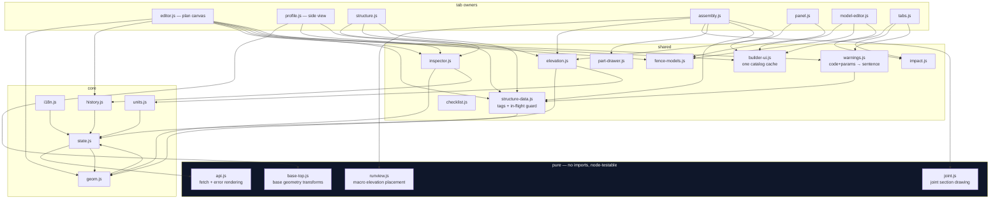
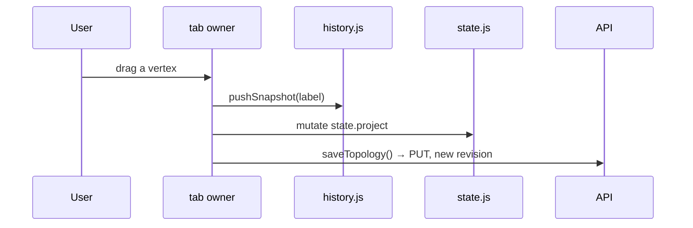

# 05 — Frontend

24 ES modules under `src/fenceai/web/static/js/`, plus SVG and CSS. **No framework,
no build step, no CDN** — fonts are bundled, modules are loaded natively by the
browser (ADR-0010). Hebrew-first RTL with an English toggle.

---

## The rule

> Modules communicate **only** through `state.js` (events and exports). No module
> touches another module's DOM subtree.

`state.js` is the hub: it holds the current project, run, selection and preferences,
and emits events others subscribe to. A tab owner owns exactly one `#tab-*` subtree.

*(Edges to `state.js` / `units.js` from every tab owner are omitted — they are
universal.)*

**One observation worth knowing:** `state.js` and `geom.js` import each other. ES
modules tolerate it because neither uses the other at module-evaluation time, but it
is the one place in the graph where the layering is not strict.

---

## Mutation discipline

Always in this order. Getting it wrong wipes the user's undo stack or writes a
revision the server rejects.

* **Undo/redo restore locally and PUT a *new forward* revision.** Server revisions
  never go backwards.
* **Non-user changes never push history.** After a non-topology mutation, call
  `reloadProject()` — not `openProject()`, which wipes undo.
* **Anchors are segment-local.** Author with `geom.anchorFor`, resolve with
  `geom.stationOfAnchor`. These mirror backend `make_anchor` / `anchor_station`
  exactly. Never read `anchor.offset_mm` as a station.

---

## Four drawings, one fence

They must never disagree, so **each one places numbers it was given** rather than
deriving its own.

| Drawing | Module | Looks | Sources its numbers from |
|---|---|---|---|
| Plan canvas | `editor.js` | down | topology + strategy overlay |
| Profile side view | `profile.js`, `base-top.js` | along, 5× vertical exaggeration | ground + post tops; base geometry is pure transforms |
| Macro run elevation | `runview.js` | standing up, true scale | the structure report — itself forbidden from recomputing |
| Panel elevation | `elevation.js`, `joint.js` | one bay | `report/elevation.py`'s rectangles, computed on the server |

**Why the panel fit is not in JS.** The fit is an algorithm with a justification ×
excess matrix, and a client copy would eventually disagree with the cut list the same
numbers produced. `elevation.js` owns exactly **one** transform — the axis flip,
because the panel frame puts y = 0 at the bottom and SVG grows downward.

**Where a drawing lacks a number it says so.** An undeclared post face or member
thickness draws as a flagged nominal (dashed, and stated in both bundles); a gate
opening with no neighbouring height gets no leaf; above 900 drawn members panels
become blocks and the panel says it simplified.

**The plan canvas, the profile and the panel elevation are NEVER mirrored in RTL** —
asserted in Hebrew *and* English by screen position, not by reading the stylesheet. A
drawing that happened to be left-to-right because the page was would pass an RTL
check by accident.

---

## The slot inspector names a part

A `FrameSlot`, `Member` and `FixingRule` each hold a `PartRequirement`, and the
Models tab's slot pane (`model-editor.js` → `panel-inspector.js`, the DOM half; the
pure logic lives in `panel-model.js` so node can test it without a browser) exists to
author that requirement honestly. It used to author a bare sku; it authors a **part**
now, because eligibility moved onto the part the requirement names.

The pane branches on `eligibilitySource(req)` — a JS function that mirrors
`PartRequirement.eligibility_source` exactly, `part_id` checked first, and the two are
kept from drifting apart by a test on each side of the mirror rather than a shared
module (they run in different runtimes). There are four shapes, and only one of them
puts a picker on screen:

* **`part`** — a `<select>` grouped by type (`partsByType`), the chosen part's
  declared facts as chips (`specChips`), and how many catalog products can fill the
  slot (`partSummary`, joined from the preview the tab already fetched — no request
  of its own).
* **`authored_predicate`** — the slot's rule agrees with a fact about the bay, which
  no part can declare (e.g. a post's routed position matching the bay's rail
  positions). Said plainly, no picker offered.
* **`authored_members`** — a sku list, rebuilt per run from company knowledge; naming
  a part here would let a fixed sku silently outrank the rule that sources it.
* **`unspecified`** — a slot the "+ Add" button just made. The pane asks for a part.

**The preference list survives only for `authored_members`.** `eligibilityList`
renders the ordered sku/priority rows, and it is offered exactly there — not on a
`part` slot (the pair a part-named requirement is refused for carrying), and not on
`authored_predicate` (a list with nothing to order).

**`role` left authoring entirely — it did not move behind Advanced, it is gone.**
`PartRequirement` refuses a slot that names a part and also states what the piece is;
`resolve_model_parts` fills `role` from the part's own type at generation, so the
field is still required on `ResolvedSlot` and the BOM still reads it — it just has no
control in the editor. `width_mm` and `thickness_mm` are the same exclusion one level
up (`_refuse_authored_dimensions`, on the frame slot's and the member's own fields,
not the requirement): naming a part **hides** the width and thickness inputs the
INFILL member offers — the frame slot's `thickness_mm` never had a control to hide —
and shows the part's own declared dimension read-only in their place, clearing
whatever number the holder carried in the same act that writes `part_id` — a stale
100 mm left by `defaultMember` is the identical 422 one field over.

---

## Units, i18n, safety

**Display units (mm | cm) are a presentation preference.** `units.js` is the only
converter: `toDisplayValue` / `toMm` at every field boundary, `tu()` to render length
strings from locale keys that carry `{…_mm}` + `{u}` and never a literal unit.
Storage, API payloads and the raw-JSON editors stay integer millimetres. A new length
surface must round-trip losslessly.

`units.money()` reads `units.currency` — which is what lets the bundle test forbid a
bare currency symbol anywhere else. Multi-currency is deliberately **not** done: that
is a `Money(amount, currency)` type through the whole cost tier plus a rate source
with an as-of date, and a symbol swap wearing its clothes is worse than one honest
currency.

**i18n.** Every user-visible string goes through `t("key")` in JS or `data-i18n` in
HTML. `i18n/he.json` and `en.json` must keep identical key sets. Enum *values* are
words too — `enumWord()` and `roleWord()` have separate namespaces, because
`concrete` is both a base surface and a part role.

**CSS uses logical properties only** — no `left`/`right`. SKUs, ids and dimensions
get `.sku` / `.num` / `<bdi>` isolation so an RTL paragraph cannot reorder a part
number.

**XSS.** Any user or expert text interpolated into `innerHTML` goes through `esc()`.
Colour is the exception that proves it: `attrs.colour` reaches the client as a CSS
`fill`, where escaping does nothing, so it is validated as `#rrggbb` at **load** in
`catalog/model.py`. Nothing server-authored reaches a colour otherwise — fills come
from a stylesheet keyed by a role from a closed set, never a SKU or a swatch.

---

## How the frontend is tested

Two tiers, because neither alone is enough.

**Node tests** (`tests/web/`) run the pure modules directly — `base-top.js`,
`runview.js`, `elevation.js`, `units.js`, the model editor's document builders — and
pin the JS vocabularies against the Python ones in **both** directions, so a role or
length rule added on one side fails the suite on the other.

**Browser smoke** (`tools/ui_smoke.py`, 187 CDP-driven checks) is the only tier that
sees rendering, event wiring and concurrency. Things it has caught that pytest
structurally could not: a rail painting black because a macro member carried its role
class but not `elev-member`; a bay selection keeping the previous bay's preview so
the cost strip quoted one panel's price under another's tag (both numbers correct in
isolation); a joint section rendering inside the panel's own render, so it ran once
while nothing was selected and never again — the box was present and simply empty;
and the Models tab's slot pane showing "no product" on every slot and refusing the
save that would fix it, passing 183 green checks the whole time because the suite had
always opened that tab and left again rather than using the pane it opened.

**A smoke check that reads the whole page body proves nothing.** Assertions are
scoped to the panel that owns the feature, and verified by deleting the feature and
watching them fail. A step that changes project state puts it back, or every later
check silently depends on that step having run.
