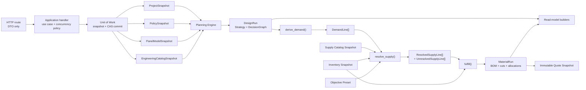

# Backend Architectural Audit

This review is based on the supplied Markdown documentation rather than an inspection of the implementation. The frontend and presentation concerns are excluded except where a backend read-model boundary is affected.

## Executive Assessment

**Overall judgment:** the system has an unusually strong deterministic core, but the application and persistence architecture has not yet caught up with the sophistication of the domain model.

The best architectural decisions should remain:

* A **modular monolith**, not microservices.
* Pure, deterministic domain computation with persistence between stages.
* Explicit separation between authored topology, generated strategy, engineering demand, and procurement.
* Append-only versions and immutable commercial snapshots.
* Traceability from BOM lines through requirements, elements, decisions, rules, and facts.
* AI restricted to interpretation, proposal, explanation polishing, and critique—not geometry, selection, arithmetic, or fulfillment.

These properties are central to the product’s promise of reproducibility and explainability.  The documented pipeline is also fundamentally sound: explicit inputs enter deterministic generation, followed by demand derivation and fulfillment. 

The primary problem is **not insufficient decomposition**. It is that decomposition has happened mostly at the domain-package level, while several critical responsibilities remain concentrated in:

1. HTTP routes acting as application services and transaction coordinators.
2. `GenerationRun` carrying both design and procurement meaning.
3. Models representing multiple lifecycle states and multiple architectural layers.
4. `strategy.generate()` coordinating too many independent decisions.
5. Cross-cutting concepts such as AI records, overrides, and decision recording being owned by the wrong packages.

### Highest-priority findings

| Finding                                                 |    Severity | Assessment                                                                                                                                                               |
| ------------------------------------------------------- | ----------: | ------------------------------------------------------------------------------------------------------------------------------------------------------------------------ |
| No explicit application/use-case layer                  |    Critical | Routes load state, bind context, call domain stages, check freshness, and persist results. This creates duplication and prevents coherent transaction handling.          |
| No first-class materialization identity                 |    Critical | Design inputs are captured in `GenerationRun`, but fulfillment additionally depends on inventory. The same generation run can therefore produce a different current BOM. |
| Route-level TOCTOU remains unresolved                   |    Critical | The global store lock protects individual calls but not complete business operations.                                                                                    |
| Boundary contracts contain invalid intermediate states  |        High | `RequirementLine` is documented both as unresolved demand and as a line already containing SKU and unit.                                                                 |
| Domain/API/LLM/storage models are one schema            |        High | This tightly couples independently evolving boundaries and makes persisted compatibility harder.                                                                         |
| Ownership direction is inverted around AI and overrides |        High | `project` depends on `ai.records` and `strategy.overrides`, although both are project-authored state or application-port concerns.                                       |
| Generator and decision recording are tightly interwoven |        High | Purity is preserved, but SRP is not: layout, component resolution, vertical geometry, safety, warnings, and graph construction share one orchestration center.           |
| Knowledge taxonomy conflates independent axes           | Medium–High | Facts, enforcement behavior, origin, lifecycle, authority, and candidate status are partly represented as peer “types.”                                                  |
| Portfolio impact scope contradicts V1 constraints       | Medium–High | One flow regenerates every project, while the system-design document says cross-project impact is deferred.                                                              |
| Documentation already shows architectural drift         |      Medium | Several maps and deep-dives disagree on contracts, ports, and persistence.                                                                                               |

---

# 1. Current Architecture Analysis

## 1.1 The modular monolith is the correct deployment architecture

The documented single-process Python/FastAPI/SQLite deployment, with no message queue, cache tier, ORM, or internal service network, is appropriate for V1. 

Splitting this into services would make the most important properties harder:

* Atomic version and audit updates.
* Deterministic snapshot loading.
* Traceability across strategy, demand, and fulfillment.
* Local testing of the complete calculation.
* Offline operation.

The modular monolith should therefore remain. The needed refactoring is **inside the process**, not across network boundaries.

## 1.2 The domain spine is strong

The separation between:

```text
authored project state
    → generated structural design
    → engineering demand
    → resolved supply
    → fulfillment/BOM
```

is the strongest part of the architecture.

The `RequirementLine` concept is particularly valuable as the narrow waist between structural design and purchasing. The traceability invariant—BOM → requirement → strategy element → decision—is also excellent. 

Similarly, keeping read models derived and forbidding them from independently recomputing quantities protects against discrepancies between engineering, drawings, and purchasing. 

These boundaries should be retained, although some currently need stronger types.

## 1.3 The API layer is secretly the application layer

The documentation states that persistence happens “in the route,” while routes also coordinate pipelines and call the store directly.  The generation sequence confirms that `api/app.py` loads multiple aggregates and snapshots, binds scopes, calls generation, and persists the result. 

That means `api/app.py` currently owns at least five responsibilities:

1. HTTP parsing and status-code mapping.
2. Use-case orchestration.
3. Snapshot assembly.
4. Concurrency and staleness policy.
5. Transaction sequencing.

The previously duplicated `derive → resolve → fulfill` paths are evidence of this missing layer: four callers copied application orchestration until they diverged. 

### Required correction

Introduce a small application layer:

```text
transport/http
    → application command/query handler
        → pure domain functions
        → UnitOfWork/repositories
```

FastAPI routes should do only:

```text
request DTO
→ invoke handler
→ map result/domain error to response DTO
```

The composition root may still live beside FastAPI startup, but route modules should not wire or coordinate the domain.

## 1.4 The current SQLite lock is a workaround, not a transaction model

The documentation is explicit that a single SQLite connection caused interleaved operations, and that the re-entrant lock now serializes each public store method. It is equally explicit that route-level read-then-write operations retain a TOCTOU window. 

This is the most important backend correctness problem.

For example:

```text
load topology revision
load knowledge snapshot
load catalog
compute design
persist run
```

is not protected as one coherent use case. State can change after the reads and before the append.

Holding a database transaction throughout generation would also be wrong because generation and impact analysis may be CPU-heavy.

### Recommended transaction pattern

Use an optimistic two-phase application transaction:

```python
snapshot = uow.capture_planning_snapshot(project_id)
# Short read transaction ends here.

draft = planning_engine.plan(snapshot.input)
# Pure computation outside the transaction.

uow.append_design_run(
    draft,
    expected_project_revision=snapshot.project_revision,
    expected_catalog_revision=snapshot.catalog_revision,
    expected_policy_snapshot=snapshot.policy_snapshot_id,
    expected_model_versions=snapshot.model_versions,
)
# Short atomic verification + append + audit transaction.
```

For SQLite:

* Use a connection per `UnitOfWork`, not one global connection.
* Use WAL mode and an explicit busy timeout.
* Use short explicit transactions.
* Verify expected revisions or hashes during the write.
* Use a shared-memory URI with a keeper connection, or temporary file databases, for tests instead of shaping the production concurrency model around `":memory:"`.

A Postgres migration can remain deferred. The immediate requirement is an application transaction boundary that works with either database.

## 1.5 `GenerationRun` conflates design generation and material fulfillment

The documented `GenerationRun` identity contains topology, knowledge, overrides, policy, model versions, catalog hash, and objective preset.  It intentionally omits inventory, while fulfillment is explicitly a pure function over an inventory snapshot. 

This creates a semantic mismatch:

* A `GenerationRun` reproducibly identifies the structural design.
* `/runs/{id}/bom` uses mutable inventory and therefore represents a later materialization.
* The objective preset is predominantly a supply-resolution concern but is stored on the design run.
* A price or inventory change can alter the BOM without altering the fence.

The current `inventory_hash` on a report helps describe what was used, but it does not create a first-class immutable identity for the calculation.

### Recommended identity split

#### `DesignRun`

Captures structural meaning:

```text
project topology snapshot
confirmed authored events
project overrides
knowledge snapshot
panel-model versions
engineering-catalog snapshot
planning-engine behavior version
hash-schema version
```

Produces:

```text
Strategy
DecisionGraph
PlanningIssues
```

#### `MaterialRun`

Captures purchasing meaning:

```text
design_run_id
demand hash
commercial/consumption catalog snapshot
inventory snapshot or revision
substitution policy
objective preset
fulfillment-engine behavior version
hash-schema version
```

Produces:

```text
DemandLines
ResolvedSupplyLines
UnresolvedSupplyLines
BOM
CutPlans
Allocations
ProjectedRemnants
SupplyIssues
```

#### `Quote`

References or embeds one immutable `MaterialRun`, plus commercial lifecycle fields.

This also permits more precise freshness behavior:

* Repricing a SKU makes a **material preview** stale.
* It does not invalidate the stored geometry or explanation of a `DesignRun`.
* Inventory changes create a new `MaterialRun`, not a different interpretation of the same BOM identifier.

## 1.6 Engine behavior is missing from the content identity

The documentation correctly states that anything changing what a run means must be part of its content-addressed identity, otherwise `INSERT OR IGNORE` could return a stale document. 

However, the documented identity contains data versions but not:

* Planning algorithm version.
* Knowledge evaluator behavior version.
* Pattern-fit algorithm version.
* Hash/canonical-serialization version.
* Fulfillment algorithm version.

A legitimate code change could therefore produce different results from the same documented inputs while attempting to reuse the same run ID.

Do not use an arbitrary Git commit as the identity. Add explicit behavior versions:

```text
planning_behavior_version = "planning-v2"
fulfillment_behavior_version = "fulfillment-v1"
canonical_hash_version = "canonical-json-v1"
```

Increment them only when behavior intentionally changes.

## 1.7 `RequirementLine` represents two different states

The architecture prose says demand emits a line with **no SKU and no unit**, and that `resolve_supply()` adds both.  The material deep-dive repeats that contract. 

But the entity and domain-model documents define `RequirementLine` with required `sku` and `unit` fields.  

Regardless of which reflects the implementation, one type is currently being asked to represent two phases.

### Recommended contracts

```python
@dataclass(frozen=True)
class DemandLine:
    id: DemandLineId
    role: PartRole
    engineering_quantity: int
    measurement: MeasurementRequirement
    eligibility: EligibilitySpec
    slot_key: str | None
    pegs: tuple[ElementRef, ...]


@dataclass(frozen=True)
class ResolvedSupplyLine:
    demand_line_id: DemandLineId
    sku: Sku
    engineering_unit: EngineeringUnit
    consumption: ConsumptionSpec
    engineering_quantity: int
    cut_length_mm: Mm | None
    pegs: tuple[ElementRef, ...]


@dataclass(frozen=True)
class UnresolvedSupplyLine:
    demand_line_id: DemandLineId
    reason_code: str
    candidates_considered: tuple[Sku, ...]
    pegs: tuple[ElementRef, ...]
```

This makes illegal states unrepresentable:

* A demand line cannot accidentally claim a SKU.
* A resolved line cannot lack a unit.
* An unresolved line cannot enter `fulfill()`.
* Fulfillment no longer needs defensive checks for partially resolved objects.

Once eligibility is carried by `DemandLine`, `fulfillment` should not need to import `fencemodel`; it should depend only on demand contracts, catalog, inventory, and fulfillment policy.

## 1.8 One Pydantic model should not be domain, API, persistence, and LLM schema

The documentation explicitly describes Pydantic models as the single schema for domain, API, and LLM validation.  This is convenient early on but creates long-term coupling:

* API compatibility and domain refactoring become the same problem.
* Persisted documents cannot evolve independently.
* LLM output schemas expose more domain surface than necessary.
* Internal fields may unintentionally become public API.
* Pydantic serialization changes can affect content hashes.
* Stored historical snapshots need old model compatibility indefinitely.

A complete four-layer duplication would also be excessive. Use selective separation:

| Boundary    | Recommended model                                                           |
| ----------- | --------------------------------------------------------------------------- |
| Pure domain | Immutable domain value objects; Pydantic or dataclasses are both acceptable |
| HTTP        | Request/response DTOs, explicitly mapped                                    |
| Persistence | Versioned stored-document envelopes with `schema_version` and upcasters     |
| AI          | Narrow proposal DTOs containing only fields the model may propose           |

The LLM should never validate or construct a complete `Project`, `KnowledgeVersion`, or `FenceModel` directly when a narrower proposal schema is sufficient.

## 1.9 Package ownership is inverted around project state and AI

The module map states that `project` depends on `ai.records` and `strategy.overrides`.  This reverses the natural dependency direction.

### Overrides

An override is authored project state. Strategy **consumes** it; strategy should not own the data type.

Move it to:

```text
domain/project/overrides.py
```

Planning can compile it into a planning directive.

Also remove the overloaded word “override” from the knowledge type system:

* `OverrideDirective`: explicit project patch.
* `PolicyException`: approved governed exception to a rule.

### Interpretation records

An `InterpretationRecord` is persisted project provenance. The AI adapter produces one, but should not own its lifecycle model.

Move the record and candidate-intent state to the project/annotation domain. The interpreter port should return a project-owned proposal DTO.

### AI ports

Ports belong to the caller, not the adapter package:

```text
application/ports/annotation_interpreter.py
application/ports/knowledge_proposer.py
application/ports/explanation_writer.py
application/ports/strategy_critic.py

infrastructure/ai/stub.py
infrastructure/ai/claude.py
```

The application layer invokes the critic **after** deterministic planning. `strategy` should have no dependency on AI, even through a port.

## 1.10 `generate()` is pure but not single-responsibility

The documented generator performs fixed-post discovery, span layout, model resolution, vertical handling, product-related decisions, safety checks, warnings, and decision-graph emission.  The domain summary similarly assigns post placement, span layout, vertical mode, heights, safety checks, warnings, and overrides to `strategy`. 

Purity makes this testable, but purity alone does not provide SRP.

The decision graph is load-bearing and should remain, but the documentation already acknowledges the cost of requiring generation code to emit correctly ordered nodes throughout the algorithm. 

### Refactored planning passes

| Component/function               | Single responsibility                                                   | Input                                 | Output                 |
| -------------------------------- | ----------------------------------------------------------------------- | ------------------------------------- | ---------------------- |
| `compile_planning_input()`       | Resolve immutable input references and normalize authored facts         | Project, snapshots, overrides         | `PlanningContext`      |
| `compile_policy()`               | Combine active knowledge, model contributions, and approved exceptions  | Knowledge/model snapshots             | `CompiledPolicy`       |
| `derive_boundaries()`            | Identify corners, gates, base transitions, model boundaries, and pins   | Topology + policy                     | `BoundarySet`          |
| `layout_spans()`                 | Partition free segments and apply span preferences                      | Boundary set + policy                 | `StructuralLayout`     |
| `resolve_vertical_geometry()`    | Determine heights, bases, top lines, slope/step/rake behavior           | Layout + topology facts               | `VerticalLayout`       |
| `resolve_panels()`               | Select model variant and fit panel members per bay                      | Vertical layout + panel models        | `PanelizedLayout`      |
| `assign_structural_components()` | Assign posts, gate kits, or other components decided during design      | Layout + engineering catalog + policy | `ComponentAssignments` |
| `validate_buildability()`        | Measure gaps, lengths, residuals, rail separation, and hard constraints | Complete proposed design              | `PlanningIssues`       |
| `finalize_design_run()`          | Validate invariants and construct immutable result                      | All pass outputs                      | `DesignRunDraft`       |

Each pass should emit evidence at the moment it decides something. A concrete `GraphBuilder` should not leak into every leaf function. Depend on a narrow protocol:

```python
class DecisionRecorder(Protocol):
    def fact(self, ...) -> DecisionRef: ...
    def decision(self, ..., evidence: tuple[DecisionRef, ...]) -> DecisionRef: ...
    def conflict(self, ...) -> DecisionRef: ...
```

Alternatively, return typed `DecisionEmission` values from each pass. The final assembler may validate and order those emissions, but must not infer explanations after the fact.

---

# 2. Refactored Component Model

The system does not need sixteen peer architectural concepts. It can retain small Python packages while exposing a simpler top-level model.

| Current modules                                           | Proposed component        | Responsibility                                                                                         | Primary output                    | Allowed dependencies                              |
| --------------------------------------------------------- | ------------------------- | ------------------------------------------------------------------------------------------------------ | --------------------------------- | ------------------------------------------------- |
| `core`                                                    | `shared_kernel`           | Units, money, typed IDs, refusal codes, canonical hashing                                              | Stable primitives                 | Nothing domain-specific                           |
| `topology`, `project`, `strategy.overrides`, `ai.records` | `domain.project`          | Human-authored and confirmed state: topology, annotations, intents, overrides, project configuration   | `ProjectSnapshot`                 | Shared kernel only                                |
| `catalog`                                                 | `domain.catalog`          | Purchasing behavior, pricing, typed engineering capabilities, substitution declarations                | `CatalogSnapshot`                 | Shared kernel                                     |
| `fencemodel`                                              | `domain.panel_model`      | Panel structure, slots, patterns, joints, option axes, eligibility declarations                        | `PanelModelSnapshot`              | Shared contracts, not concrete catalog/evaluator  |
| `knowledge`, governance half of `learning`                | `domain.policy`           | Rule versions, evaluation, precedence, candidates, review, policy exceptions                           | `PolicySnapshot`, `RuleFirings`   | Shared kernel                                     |
| `strategy`, `decisions`                                   | `domain.planning`         | Deterministic structural proposal and causal evidence                                                  | `DesignRun`                       | Project, policy, panel model, engineering catalog |
| `demand`, `fulfillment`                                   | `domain.materials`        | Demand derivation, supply resolution, cutting, packaging, inventory allocation, pricing                | `MaterialRun`                     | Planning contracts, catalog, inventory            |
| `report`                                                  | `application.read_models` | Derived query projections; never authoritative state                                                   | Structure/explanation projections | Immutable design/material runs                    |
| impact half of `learning`, current pipelines              | `application`             | Use cases, snapshot assembly, staleness, transaction boundaries, impact orchestration, quote lifecycle | Command/query results             | Domain + ports + UoW                              |
| AI implementations                                        | `infrastructure.ai`       | Stub and external-model adapters                                                                       | Application-port results          | Application ports                                 |
| `store`                                                   | `infrastructure.sqlite`   | Repositories and transactional UnitOfWork                                                              | Persisted snapshots               | Application repository contracts                  |
| `api`                                                     | `transport.http`          | HTTP DTOs, routers, error mapping, authentication later                                                | REST/JSON                         | Application handlers only                         |

A practical package structure would be:

```text
src/fenceai/
├── shared/
│   ├── units.py
│   ├── ids.py
│   ├── errors.py
│   └── hashing.py
├── domain/
│   ├── project/
│   ├── catalog/
│   ├── panel_model/
│   ├── policy/
│   ├── planning/
│   └── materials/
├── application/
│   ├── commands/
│   ├── queries/
│   ├── read_models/
│   ├── ports/
│   └── uow.py
├── infrastructure/
│   ├── sqlite/
│   └── ai/
└── transport/
    └── http/
```

This is not a request to turn each row into a class hierarchy. Most domain operations should remain immutable values and module-level pure functions.

---

# 3. Data Flow and Decoupling

## Proposed backend flow



## State categories

State handling will become much clearer if every object belongs to one of these categories:

| State class                        | Examples                                                       | Mutation rule                                                         |
| ---------------------------------- | -------------------------------------------------------------- | --------------------------------------------------------------------- |
| Authored, revisioned               | Topology, project settings, current inventory                  | Update with expected revision; preserve prior revision or audit trail |
| Governed, versioned                | Knowledge, published panel models, preferably catalog versions | Append a new immutable version                                        |
| Derived, immutable design          | `DesignRun`, strategy, decision graph                          | Never update; generate a new run                                      |
| Derived, immutable materialization | `MaterialRun`, BOM, cut plans, allocations                     | Never update; compute a new material run                              |
| Commercial snapshot                | Quote body                                                     | Immutable; lifecycle status stored separately or changed atomically   |
| Ephemeral preview                  | Unsaved model preview, current-inventory BOM preview           | Clearly named as preview; never silently accepted                     |

## Internal communication

For V1, use direct typed calls. Do **not** add:

* An internal event bus.
* A message queue.
* Microservice IPC.
* A generic plugin registry.

When cross-project impact analysis eventually becomes asynchronous, its worker input should be immutable references:

```text
impact_job_id
candidate_policy_version
baseline project snapshot IDs
planning behavior version
material behavior version
```

It should not receive loosely serialized live domain objects.

---

# 4. Targeted Simplifications

## 4.1 Simplify the knowledge taxonomy without weakening its semantics

The current seven knowledge types are:

```text
fact
hard_constraint
company_rule
preference
heuristic
override
candidate
```

The documentation itself says a fact is not a rule and a candidate is not evaluated while proposed.  This indicates that several independent dimensions have been compressed into one enum.

Preserve the different runtime behaviors, but model them orthogonally:

```text
lifecycle:
    draft | proposed | active | retired | rejected

effect:
    constraint | default | ranking_preference | advisory

enforcement:
    block | warn | none

origin:
    manufacturer | company | project | correction | interpretation

authority:
    integer

scope:
    validated ScopeSpec
```

Then:

* A **fact** belongs in the evaluation context, not in the rule-type enum.
* A **candidate** is a lifecycle state.
* A project **override directive** belongs to the project.
* An approved **policy exception** is a governed policy rule.
* `company_rule` versus `hard_constraint` becomes authority, enforcement, and exception policy.
* `preference` versus `heuristic` becomes authority/weight rather than a wholly separate execution pipeline.

This reduces branching without collapsing safety constraints into preferences.

## 4.2 Keep the open catalog, but type anything deterministic code reads

The open `attrs` bag is intentionally flexible, but deterministic code already reads keys such as `length_mm` and `opening_width_mm`.  Once an attribute affects geometry, safety, feasibility, or purchasing, it is no longer mere metadata.

Use:

```text
Product
├── identity and localized names
├── consumption
├── pricing
├── engineering capabilities
│   ├── LinearStockCapability
│   ├── PostCapability
│   ├── GateKitCapability
│   └── ...
└── metadata: open dict
```

A bamboo product can still be introduced without a release. But algorithms should call typed capabilities rather than look up magic dictionary strings.

Apply the same rule elsewhere:

> Data consumed by deterministic logic is typed and versioned. Data used only for display, annotation, or forward-compatible metadata may remain open.

This should also be applied to `Project.policy`, knowledge scopes, correction patches, and any option dictionary that deterministic code reads.

## 4.3 Move quotation lifecycle out of fulfillment

`fulfillment` currently owns both engineering/purchasing calculation and immutable quotes. Those responsibilities will diverge as soon as quotations gain:

* Validity dates.
* Customer or project terms.
* Taxes.
* Discounts.
* Approval state.
* Revisions or supersession.

Keep BOM pricing in materials. Put quote creation and lifecycle in `application/quotes`, consuming an immutable `MaterialRun`.

## 4.4 Clarify “run” identities

The model contains both a topology `Run` and a `GenerationRun`, while override anchors also contain `run_id`.   

At minimum, use explicit field and ID types:

```text
TopologyRunId / topology_run_id
DesignRunId / design_run_id
MaterialRunId / material_run_id
```

Renaming topology `Run` to `Alignment`, `Stretch`, or `FencePath` would further reduce ambiguity, but typed names are sufficient if “run” is established domain terminology.

## 4.5 Limit V1 AI ports to proven use cases

The detailed AI document defines four ports, while the domain overview says three.  

The hard AI boundary is sound and should stay.  However, every port adds an adapter, validation schema, fallback behavior, contract tests, logging, and operational semantics.

For V1:

* Keep `AnnotationInterpreter`.
* Keep `KnowledgeProposer` if the correction loop is part of V1.
* Keep deterministic Tier-1 explanation as authoritative.
* Treat `ExplanationWriter` as optional infrastructure.
* Treat `StrategyCritic` as a post-processing application extension, not a planning dependency.

## 4.6 Bound impact analysis explicitly

One flow says candidate preview regenerates every project.  The system-design deep-dive says cross-project impact is deferred and only single-project analysis exists in V1. 

The latter is the appropriate V1 boundary.

Portfolio-wide regeneration would be incompatible with:

* A synchronous API request.
* One process.
* A serialized SQLite store.
* No job infrastructure.
* Potentially expensive planning and fulfillment passes.

Keep single-project impact synchronous. When portfolio impact is required, make it an explicit persisted batch job rather than hiding it inside a review endpoint.

---

# 5. Documentation Consistency Defects

The documentation index says deep-dives win when documents disagree, and also states that a drifted diagram is worse than no diagram.   Several inconsistencies should therefore be fixed as architecture defects, not editorial details.

| Inconsistency                                                                                                                | Documents                                                                              |
| ---------------------------------------------------------------------------------------------------------------------------- | -------------------------------------------------------------------------------------- |
| `RequirementLine` has no SKU/unit before resolution, but entity diagrams make both required                                  | `01-domains.md`, `material-optimization.md` versus `02-entities.md`, `domain-model.md` |
| AI has three ports versus four ports                                                                                         | `01-domains.md` versus `ai-layer.md`                                                   |
| Candidate impact regenerates every project versus historical cross-project impact being deferred                             | `03-flows.md` versus `system-design.md`                                                |
| Persistence says “eight tables” but enumerates nine, including `audit_log`                                                   | `04-backend.md`                                                                        |
| `project` depends on `strategy.overrides` in one module map, while the conceptual domain graph does not show that dependency | `system-design.md` versus `01-domains.md`                                              |
| Warning contracts are described as structured `code + params`, while the prose domain model still shows a `message` field    | `04-backend.md` versus `domain-model.md`                                               |

Add backend architecture checks for:

* Forbidden imports between packages.
* Persisted table/schema inventory.
* Port inventory.
* API route inventory.
* Domain enum vocabulary.
* Stored-document schema versions.
* Hash identity field lists.

The docs claim the dependency rule is mechanical; the enforcement mechanism should be named and tested as part of the architecture contract. 

---

# 6. Concrete Recommendations and Phasing

## Phase 0 — Correctness and boundary repair

| Change                                                                | Completion criterion                                                                       |
| --------------------------------------------------------------------- | ------------------------------------------------------------------------------------------ |
| Add application command/query handlers                                | No route coordinates more than one repository or invokes multiple domain stages directly   |
| Add transactional `UnitOfWork` and optimistic expected-version writes | No route-level read-then-write TOCTOU remains                                              |
| Split `DesignRun` from `MaterialRun`                                  | Inventory and procurement objective are part of material identity, not structural identity |
| Add explicit engine and hash behavior versions                        | Legitimate algorithm changes cannot reuse an old content-addressed ID                      |
| Split `DemandLine`, `ResolvedSupplyLine`, and `UnresolvedSupplyLine`  | `fulfill()` accepts only fully resolved lines                                              |
| Resolve the documentation contradictions                              | Maps and deep-dives describe the same current contracts                                    |

## Phase 1 — SRP and dependency cleanup

| Change                                                          | Completion criterion                                                              |
| --------------------------------------------------------------- | --------------------------------------------------------------------------------- |
| Move overrides and interpretation records into `domain.project` | Project domain imports neither AI adapters nor planning                           |
| Move AI protocols into application-owned ports                  | Infrastructure implements ports; domain does not depend on `ai`                   |
| Decompose planning into explicit pure passes                    | `generate()` becomes a thin coordinator or is replaced by `PlanningEngine.plan()` |
| Introduce `DecisionRecorder` abstraction                        | Planning logic does not import or manipulate concrete graph storage structures    |
| Type catalog engineering capabilities                           | No deterministic algorithm reads magic keys from `Product.attrs`                  |
| Separate HTTP, persisted, LLM, and domain contracts selectively | Public and stored schemas can evolve without changing the core model              |
| Add `schema_version` and upcasters to stored JSON documents     | Old immutable runs remain readable after schema evolution                         |

## Phase 2 — Scalability only when measured

| Trigger                                                               | Response                                                                                                     |
| --------------------------------------------------------------------- | ------------------------------------------------------------------------------------------------------------ |
| Multiple processes or meaningful concurrent writers                   | Move persistence adapter to Postgres; application and UoW contracts remain unchanged                         |
| Portfolio-wide impact analysis                                        | Add persisted jobs and a worker; do not introduce a general event platform                                   |
| Decision graphs become large or element explanation reads become slow | Split graph storage or index by `(design_run_id, scope_ref)`                                                 |
| Supply resolution repeatedly simulates equivalent cut plans           | Add request-scoped memoization keyed by candidate SKU and demanded length multiset                           |
| Derived read models become expensive                                  | Cache only immutable results by `DesignRunId`/`MaterialRunId`; do not introduce a generic mutable cache tier |

Backend concurrency testing should also move out of reliance on browser smoke tests. The documentation notes that the frontend smoke suite was the only detector of the SQLite concurrency defect.  Add direct concurrent backend tests using a file-backed SQLite database and parallel UnitOfWork instances.

---

# Final Architectural Position

The correct target is **not a more distributed architecture**. It is a cleaner modular monolith with:

```text
explicit authored state
→ immutable DesignRun
→ typed DemandLines
→ immutable MaterialRun
→ immutable Quote
```

surrounded by:

```text
thin HTTP transport
application use cases
short transactional UnitOfWork boundaries
pure domain engines
replaceable infrastructure adapters
```

The system’s load-bearing ideas—determinism, provenance, append-only versions, explicit refusals, AI isolation, and BOM traceability—are strong. The next refactor should preserve all of them while removing three ambiguities:

1. **Who coordinates a use case?** The application layer, not the route.
2. **What exactly does a run identify?** Design and materialization are separate runs.
3. **What state does a contract represent?** Authored, unresolved, resolved, fulfilled, or quoted—never several at once.

