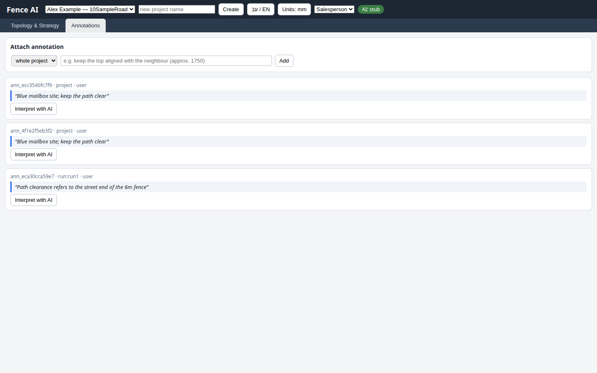
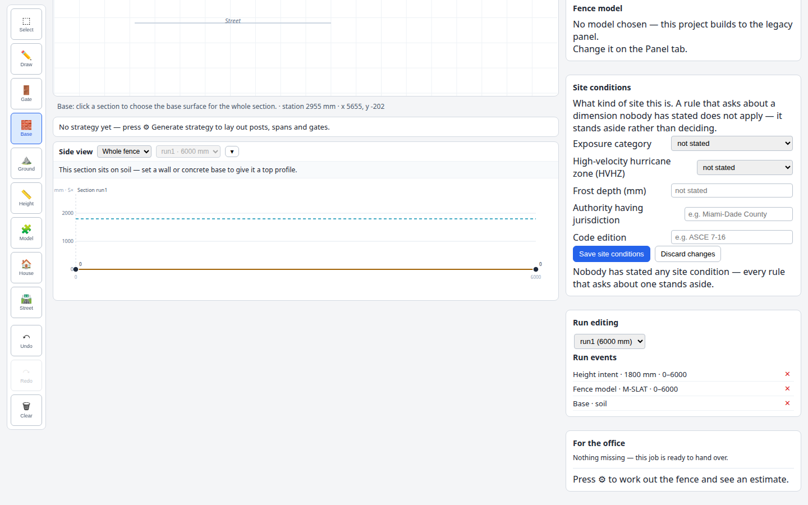

# Fence AI: independent salesperson resume simulation

## Primary visual evidence

The screenshot below visibly identifies **Alex Example - 10SampleRoad** in the job selector and shows the retained original text, **Blue mailbox site; keep the path clear**, plus **Path clearance refers to the street end of the 6m fence** with the saved **run:run1** scope after reload. The duplicate original is an automation artifact described below.

The supporting screenshot shows the same job's **run1 (6000 mm)**, **Height intent 1800 mm, 0-6000**, **Fence model M-SLAT, 0-6000**, and **Base soil** records. Height and model were verified after reload; explicit soil was added afterward and checked through switching. These screenshots show separate views, not a combined capture.

## Outcome

Created two sold-job records for the same customer at different addresses. Both contain the requested straight fence, height, Slat model event, explicit soil base, and original site note. Added the correction to the 6 m run while preserving the original. No cross-job values or notes were observed. Reload did not resume the job being viewed: it opened 20SampleRoad after reloading from 10SampleRoad. Manually recovered 10SampleRoad and finished there before closing the browser.

The first original note appears twice because of an automation recovery mistake. This is a known artifact, not evidence that the app spontaneously duplicates notes. No visible deletion control was found in the Notes view; both copies were left intact.

## Method and limits

- Used only http://127.0.0.1:8833, rendered screenshots inspected with view_image, and normal browser clicks, typing, selection, drawing drags, scrolling, and reload.
- Used the requested Playwright installation and /usr/bin/google-chrome with --no-sandbox, --disable-gpu, --disable-dev-shm-usage; viewport 1440 x 900. Chrome ran headless, with decisions based on its rendered screenshots.
- Did not inspect app source, previous reports, APIs, database, network bodies, runtime state, or hidden DOM. Locators only operated visible form controls. No app changes or server stop.
- This is an automated unfamiliar-salesperson simulation, not human participant evidence. No timing, emotion, or human success-rate claims.
- Used 30 task-level decisions, with recovery attempts grouped under the decision being attempted; no blocked interaction received more than three sensible tries. Ten screenshots retained.
- Did not generate strategy or an estimate. No gate was requested or added. Approximate unlabeled House and Street context was drawn for both sites.
- Persistence claims below describe visible results after switching/reload, not a backend durability guarantee. Explicit soil events and the first site's successful street drawing were added after the reload; a second reload was not performed.

## Exact values and persistence

| Field | 10SampleRoad | 20SampleRoad | Evidence |
| --- | --- | --- | --- |
| Customer | Alex Example | Alex Example | First final overview; second reload overview |
| Address | 10SampleRoad | 20SampleRoad | Distinct after reload and subsequent switching |
| Sold by / You | Morgan | Morgan | Both visible after reload |
| Sold on | 2026-09-06, rendered 09/06/2026 | 2026-09-06, rendered 09/06/2026 | Both visible after reload |
| Straight section | run1, 6000 mm | run1, 4000 mm | Drawing labels and Run editing selectors |
| Height event | 1800 mm, 0-6000 | 1600 mm, 0-4000 | Both visible in Run events after reload |
| Model event | M-SLAT, 0-6000 | M-SLAT, 0-4000 | Both visible in Run events after reload |
| Base | soil, explicitly saved | soil, explicitly saved | Both final Run events show Base soil; first remained visible after switching away and back |
| Original project note | Blue mailbox site; keep the path clear | Red doorway site; leave the existing shrubs | Exact text survived reload and switching; first has two identical copies |
| Correction | Path clearance refers to the street end of the 6m fence | Absent | First note record visibly says run:run1 after reload; second shows only its red-doorway note |

The correction is scoped to the entire run1 stretch, not to an endpoint or a narrower station range. The Notes target menu offered whole project and run1. The original remains scoped to project. Approximate street context does not establish a uniquely labeled endpoint, so the wording still requires interpretation by the office.

## Findings

1. **Reload loses the active job and working view.** Immediately before reload, 10SampleRoad Notes contained the scoped correction. Reload opened 20SampleRoad in the drawing view. The customer name was identical, making address and length the useful checks. This was recoverable through the selector, but it interrupts continuation and risks work on the wrong site. See 05, 06, and 09.
2. **Salesperson wording only partially survives reload.** The selector still said Salesperson, but The job / Notes became Topology & Strategy / Annotations; Work out the fence became Generate strategy, and What was sold became Model. The job form still said You. This inconsistent vocabulary makes resuming harder for the intended role. See 02 versus 06.
3. **Model confirmation is contradictory.** Both jobs visibly retain M-SLAT in Run events, yet the prominent Fence model section says no model chosen, mentions a legacy panel, and directs the user to a Panel tab that is absent in the salesperson view. The page does not explain the difference between the project model and a stretch model. See 07 and 08.
4. **Reopening a tool is not a reliable saved-value check.** On 20SampleRoad after reload, Height opened with 1800 and Model with Legacy panel, although the saved events below showed 1600 and M-SLAT. These appear to be new-event forms with defaults. Their wording does not make that distinction clear. Canceled both dialogs without saving; verified the existing Run events instead.
5. **Saving confidence depends on finding records below the fold.** Job details has a Save button and missing-field feedback, while stretch changes have separate Save buttons. No persistent saved-at indicator was observed. The lower Run events and exact note list supplied stronger evidence than the main overview. Before explicitly saving soil, the side view said the section sat on soil, while For the office said soil was assumed. Explicit soil removed that missing-information warning and produced a visible readiness message.
6. **Job finding works at this small scale, with a distracting second name field.** The selector included Alex Example plus the full distinct address. It was possible to recover the right site. The adjacent new-job name field retained the last entered 20SampleRoad text while 10SampleRoad was selected, until reload cleared it. It can be mistaken for another active-job title. No larger job list or search workflow was tested.
7. **Scope is available but technical.** The target selector supports run1 and the saved record exposes run:run1. The correction remained separate from the original. Internal-looking annotation IDs and the term Attach annotation add noise for a salesperson, and no edit/delete control was visible for cleaning up the duplicate.

## Useful strengths

- English and Salesperson were discoverable in the top bar; Salesperson reduced navigation to two task-oriented tabs before reload.
- New jobs began with blank identity fields and an empty drawing; the second Notes view began empty.
- A 1 m grid made exact 6 m and 4 m straight sections possible with two clicks and Enter; the displayed millimeter lengths confirmed them.
- Whole-stretch ranges were filled automatically in height/model forms. Run events exposed exact saved values and ranges, allowing the differing heights to be verified.
- Project and run notes coexist. The correction survived reload without replacing the original or appearing at the other address.
- Drawing a house rectangle and dragging a street line produced useful approximate site context. Explicit soil produced a clear Base soil event and a ready-to-hand-over message.

## Automation failures, kept separate from product findings

- Initial noninteractive command session closed standard input and therefore the browser after the first screenshot. Restarted with a persistent terminal; no job had been created yet.
- Clicking the native role menu option by screenshot coordinates did not select Salesperson. Keyboard selection recovered it.
- Typing the unseparated date into the native date control left it blank. Filling the visible date input with 2026-09-06 recovered it; the rendered date was checked.
- After the role changed, a stale new-project placeholder locator timed out at 30 seconds. The earlier Add action had already succeeded. Recovery unnecessarily repeated Add, creating the duplicate blue-mailbox note, then used the visible name field and New job control.
- First street attempt used two clicks and Enter; no street appeared. Dragging succeeded on the second site and subsequently on the first site.
- Assumed project ordering selected the pre-existing sample project during one switch. Opened the visible menu, read the addresses, and recovered 10SampleRoad. No edits were made to the sample project.
- A click immediately after scrolling upward missed the intended Notes tab; its intermediate screenshot was replaced after waiting for scroll settlement and successfully opening Annotations.

## Decision trail

1. Switch the initial Hebrew interface to English.
2. Discover and select Salesperson; recover native-menu selection.
3. Create Alex Example - 10SampleRoad.
4. Enter and save first identity/sale fields; recover date entry.
5. Draw and finish the 6 m straight section.
6. Save 1800 mm across 0-6000.
7. Select and save Slat across 0-6000.
8. Draw first house context.
9. Attempt first street context with clicks.
10. Add the blue-mailbox project note.
11. Create Alex Example - 20SampleRoad; recover stale locator, with duplicate-note artifact.
12. Enter and save second identity/sale fields.
13. Draw and finish the 4 m straight section.
14. Save 1600 mm across 0-4000.
15. Select and save Slat across 0-4000.
16. Draw second house and street context using a drag.
17. Add the red-doorway project note.
18. Find and switch to first job; recover mistaken sample-project selection.
19. Add the correction targeted to run1.
20. Reload to simulate interruption.
21. Check second-job identity and reopen height/model tools without saving defaults.
22. Scroll to verify second-job saved Run events.
23. Return toward first job, recovering the scroll/navigation click.
24. Complete first-job street with a drag.
25. Explicitly save soil on first run.
26. Verify first-job saved height/model/base records.
27. Verify first originals and scoped correction after reload.
28. Switch to second Notes and verify only the red-doorway note.
29. Explicitly save second soil and verify its final records.
30. Resume first job, verify final visible identity/geometry/base, and close browser.

## Screenshots

- [00-current.png](00-current.png): final resumed 10SampleRoad overview.
- [01-language-role.png](01-language-role.png): English interface with role menu open.
- [02-first-job.png](02-first-job.png): first saved identity, 6000 mm section, house, and initial salesperson wording.
- [03-first-original-note.png](03-first-original-note.png): original blue-mailbox note, including the recovery-created duplicate.
- [04-second-note.png](04-second-note.png): second site's sole red-doorway note after reload and switching.
- [05-scoped-correction.png](05-scoped-correction.png): first site's original notes plus run1 correction before reload.
- [06-reload-resume.png](06-reload-resume.png): reload unexpectedly opens second job and changes vocabulary.
- [07-second-persisted-values.png](07-second-persisted-values.png): 4000 mm, 1600 mm, M-SLAT and explicit soil records; readiness feedback.
- [08-first-persisted-values.png](08-first-persisted-values.png): 6000 mm, 1800 mm, M-SLAT and explicit soil records; contradictory model summary.
- [09-first-resumed-notes.png](09-first-resumed-notes.png): original text and run-scoped correction preserved after reload.
