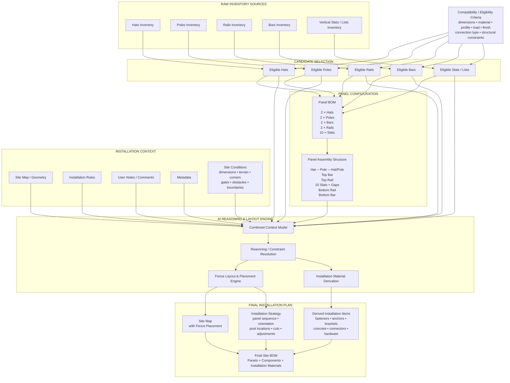
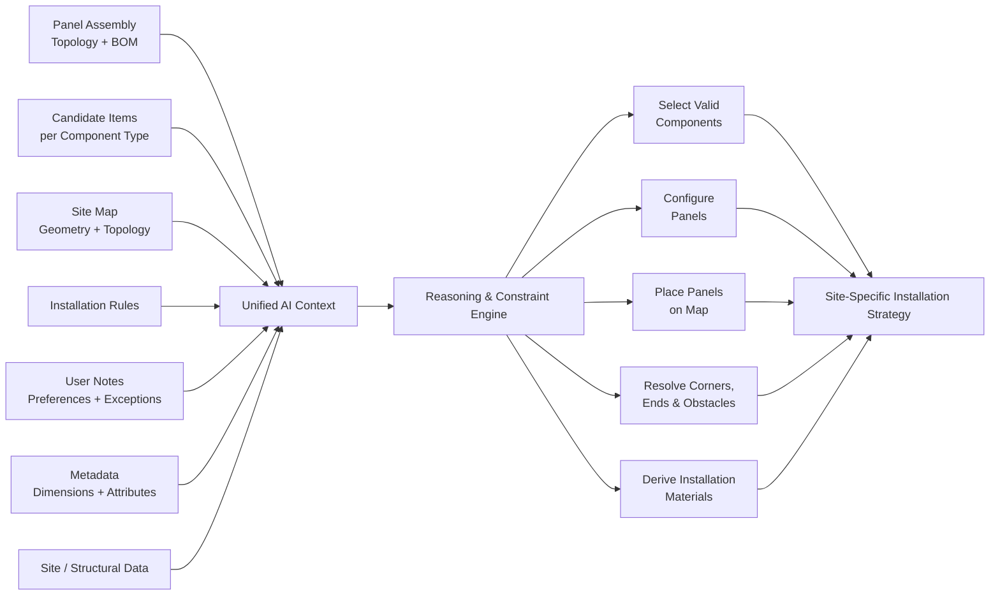

# Fence Panel Configuration & AI Installation System

## 1. Single Fence Panel — Physical Assembly

```text
                              SINGLE FENCE PANEL

        LEFT POST                                                  RIGHT POST

          ┌─────┐                                                    ┌─────┐
          │ HAT │                                                    │ HAT │
          └──┬──┘                                                    └──┬──┘
             │                                                          │
          ┌──┴──┐                                                    ┌──┴──┐
          │POLE │                                                    │POLE │
          │     │                                                    │     │
          │     ├══════════════════ TOP BAR ═════════════════════════┤     │
          │     ├────────────────── TOP RAIL ────────────────────────┤     │
          │     │                                                    │     │
          │     │   │   │   │   │   │   │   │   │   │   │            │     │
          │     │   │   │   │   │   │   │   │   │   │   │            │     │
          │     │   │   │   │   │   │   │   │   │   │   │            │     │
          │     │   │   │   │   │   │   │   │   │   │   │            │     │
          │     │  S1  S2  S3  S4  S5  S6  S7  S8  S9 S10            │     │
          │     │   │   │   │   │   │   │   │   │   │   │            │     │
          │     │   │   │   │   │   │   │   │   │   │   │            │     │
          │     │   │   │   │   │   │   │   │   │   │   │            │     │
          │     │                                                    │     │
          │     ├──────────────── BOTTOM RAIL ───────────────────────┤     │
          │     ├════════════════ BOTTOM BAR ════════════════════════┤     │
          │     │                                                    │     │
          └─────┘                                                    └─────┘

                   <---- uniform gaps between vertical slats ---->

Components:
  HAT         × 2     Post caps
  POLE        × 2     Left / right structural posts
  BAR         × 2     Top + bottom structural reinforcement
  RAIL        × 2     Top + bottom slat-supporting rails
  SLAT/LIST   × 10    Vertical infill elements
```

### Structural Hierarchy

```text
Fence Panel
│
├── Left Post Assembly
│   ├── Hat
│   └── Pole
│
├── Right Post Assembly
│   ├── Hat
│   └── Pole
│
└── Span Between Posts
    │
    ├── Top Bar
    │
    ├── Top Rail
    │
    ├── Vertical Infill
    │   ├── Slat 01
    │   ├── Slat 02
    │   ├── Slat 03
    │   ├── Slat 04
    │   ├── Slat 05
    │   ├── Slat 06
    │   ├── Slat 07
    │   ├── Slat 08
    │   ├── Slat 09
    │   └── Slat 10
    │
    ├── Bottom Rail
    │
    └── Bottom Bar
```

---

## 2. Inventory → Panel → Installation Data Flow



---

## 3. Logical Processing Model

```text
┌──────────────────────────────────────────────────────────────────────────┐
│                          INVENTORY DATABASE                              │
├─────────────┬─────────────┬─────────────┬─────────────┬──────────────────┤
│    HATS     │    POLES    │    RAILS    │    BARS     │  SLATS / LISTS   │
│             │             │             │             │                  │
│ Hat-A       │ Pole-A      │ Rail-A      │ Bar-A       │ Slat-A           │
│ Hat-B       │ Pole-B      │ Rail-B      │ Bar-B       │ Slat-B           │
│ Hat-C       │ Pole-C      │ Rail-C      │ Bar-C       │ Slat-C           │
│ ...         │ ...         │ ...         │ ...         │ ...              │
│             │             │             │             │                  │
│ ✓ eligible  │ ✓ eligible  │ ✓ eligible  │ ✓ eligible  │ ✓ eligible       │
│ ✗ reject    │ ✗ reject    │ ✗ reject    │ ✗ reject    │ ✗ reject         │
└──────┬──────┴──────┬──────┴──────┬──────┴──────┬──────┴────────┬─────────┘
       │             │             │             │               │
       ▼             ▼             ▼             ▼               ▼
┌──────────────────────────────────────────────────────────────────────────┐
│                        ELIGIBLE COMPONENT POOL                           │
│                                                                          │
│    Hats[]     Poles[]     Rails[]     Bars[]     VerticalSlats[]        │
└──────────────────────────────────┬───────────────────────────────────────┘
                                   │
                                   ▼
┌──────────────────────────────────────────────────────────────────────────┐
│                         PANEL CONFIGURATION                              │
│                                                                          │
│    Required BOM                         Assembly Constraints              │
│    ────────────                         ────────────────────              │
│    2 × Hats                            Hat attached to each Pole          │
│    2 × Poles                           Bar spans between Poles            │
│    2 × Bars                            Rail under/above slats             │
│    2 × Rails                           Slats between Rails                │
│   10 × Slats                           Uniform slat spacing               │
└──────────────────────────────────┬───────────────────────────────────────┘
                                   │
                                   │
             ┌─────────────────────┼─────────────────────┐
             │                     │                     │
             ▼                     ▼                     ▼
      ┌────────────┐       ┌──────────────┐      ┌──────────────┐
      │ SITE MAP   │       │ RULES +      │      │ STRUCTURED   │
      │            │       │ USER NOTES   │      │ METADATA     │
      │ boundaries │       │              │      │              │
      │ lengths    │       │ constraints  │      │ dimensions   │
      │ corners    │       │ preferences  │      │ materials    │
      │ obstacles  │       │ exceptions   │      │ attributes   │
      └──────┬─────┘       └──────┬───────┘      └──────┬───────┘
             │                    │                     │
             └────────────────────┼─────────────────────┘
                                   ▼
                  ┌──────────────────────────────────┐
                  │      AI REASONING ENGINE         │
                  │                                  │
                  │  • interpret site topology       │
                  │  • select component candidates   │
                  │  • satisfy panel constraints     │
                  │  • resolve installation rules    │
                  │  • determine panel placement     │
                  │  • determine cuts/adaptations    │
                  │  • derive installation items     │
                  └────────────────┬─────────────────┘
                                   │
                     ┌─────────────┼─────────────┐
                     │             │             │
                     ▼             ▼             ▼
             ┌──────────────┐ ┌──────────────┐ ┌─────────────────┐
             │ MAP LAYOUT   │ │ INSTALLATION │ │ DERIVED ITEMS   │
             │              │ │ STRATEGY     │ │                 │
             │ panel P1     │ │              │ │ fasteners       │
             │ panel P2     │ │ order        │ │ brackets        │
             │ panel P3     │ │ placement    │ │ anchors         │
             │ gate         │ │ orientation  │ │ concrete        │
             │ corners      │ │ adjustments  │ │ connectors      │
             └──────┬───────┘ └──────┬───────┘ └────────┬────────┘
                    │                │                  │
                    └────────────────┼──────────────────┘
                                     ▼
                     ┌──────────────────────────────┐
                     │   SITE-SPECIFIC FINAL PLAN   │
                     │                              │
                     │ • installation map           │
                     │ • panel/component selection  │
                     │ • installation sequence      │
                     │ • complete derived BOM       │
                     └──────────────────────────────┘
```

---

## 4. Component Breakdown and Candidate Selection

|Component|Count per Panel|Position|Structural Role|Candidate Selection Criteria|
|---|--:|---|---|---|
|**Hat / Post Cap**|2|Top of left and right poles|Caps and protects the poles; may provide aesthetic or sealing function|Must match pole cross-section/profile, dimensions, mounting mechanism, material/finish, environmental requirements|
|**Pole / Post**|2|Left and right sides|Primary vertical structural support; transfers fence loads into the ground or mounting structure|Required height, cross-section, wall thickness, structural strength, material, finish, compatible hat, compatible rails/bars, installation method|
|**Top Bar**|1|Across panel above top rail|Upper reinforcement/trim spanning between poles|Required span, profile, stiffness, mounting interface, compatibility with poles, material, finish|
|**Bottom Bar**|1|Across panel beneath bottom rail|Lower reinforcement/trim spanning between poles|Required span, profile, stiffness, ground-clearance requirements, mounting interface, material, finish|
|**Top Rail**|1|Below top bar|Supports and positions upper ends of vertical slats|Required panel width, slat interface, profile geometry, structural capacity, connection method, compatibility with poles|
|**Bottom Rail**|1|Above bottom bar|Supports and positions lower ends of vertical slats|Required panel width, slat interface, profile geometry, structural capacity, connection method, compatibility with poles|
|**Vertical Slat / List**|10|Between top and bottom rails|Panel infill; provides coverage, appearance, and local stiffness|Required height, width, thickness, profile, rail compatibility, spacing requirements, material, finish|
|**Slat Gap**|9–11 depending edge-spacing model|Between adjacent slats and potentially panel edges|Maintains required spacing and determines visual/privacy characteristics|Derived from usable panel width, slat width, slat count, edge-gap rules, minimum/maximum permitted spacing|
|**Fasteners**|Derived|Connections throughout panel|Mechanically connects panel components|Derived from selected materials, profiles, connection types, loads, corrosion/environmental requirements|
|**Brackets / Connectors**|Derived|Pole-to-rail, pole-to-bar, or site-specific connections|Transfers loads between components and simplifies installation|Derived from selected component interfaces and installation rules|
|**Anchors**|Derived|Pole/base mounting points|Connects fence structure to existing concrete/structure where applicable|Substrate type, pole load, anchor geometry, environmental conditions, installation rules|
|**Concrete**|Derived|Pole foundations where required|Provides foundation and lateral stability|Pole dimensions, fence height, soil/site conditions, footing rules, loads, required embedment|

---

## 5. Candidate Eligibility Model

```text
RAW ITEM
   │
   ▼
┌────────────────────────────┐
│ Correct Component Category?│
└──────────────┬─────────────┘
               │ yes
               ▼
┌────────────────────────────┐
│ Dimensional Compatibility? │
│                            │
│ width / height / length    │
│ profile / thickness        │
└──────────────┬─────────────┘
               │ yes
               ▼
┌────────────────────────────┐
│ Structural Compatibility?  │
│                            │
│ strength / stiffness       │
│ load / support requirements│
└──────────────┬─────────────┘
               │ yes
               ▼
┌────────────────────────────┐
│ Interface Compatibility?   │
│                            │
│ Pole ↔ Hat                 │
│ Pole ↔ Rail                │
│ Pole ↔ Bar                 │
│ Rail ↔ Slat                │
└──────────────┬─────────────┘
               │ yes
               ▼
┌────────────────────────────┐
│ Rules / Material / Finish? │
└──────────────┬─────────────┘
               │ yes
               ▼
       ┌───────────────┐
       │   ELIGIBLE    │
       │   CANDIDATE   │
       └───────────────┘
```

---

## 6. AI Reasoning Context



---

installation steps:
1. map the surface 
2. pick heights, installation details, free text, gates, ...
3. pick a fence model (Panel) - later: add session specific changes
4. suggest an installation strategy.
5. user can inspect the decision graph, focus on specific sections of the fence and get only the decisions related to the selected session.
change, comment or start a conversion about it!
6. the installation strategy is presented. this is showin how it will look like in terms of how each section is built - now many panels, the panel is shown in detail (for example: lower and upper bars, poles, rails, hats, lists, ...) - not too detailed but good enough to understand and get the impression of the whole deal.
7. BOM - also can be divided into panels/sections/ decisions, also offer visual representation.

(*) it would be extremely cool if there would be an animation of the materials build up the fence!

Admin:

1. the user can edit, delete, change rules
2. the user can edit, delete, change fence panels easily and visually (both visually and general).
3. each fence panel has assembly rules and instructions (also support installation rules and instructions).
4. fence panel is made of of parts with necessary specs.
5. items in the inventory have specs, that way items can be assigned as parts!
6. Item <-> part <-> installation requirements can also have rules, decisions, knowledge, ...
different items could leave out different leftovers or could not fit in certain conditions!
